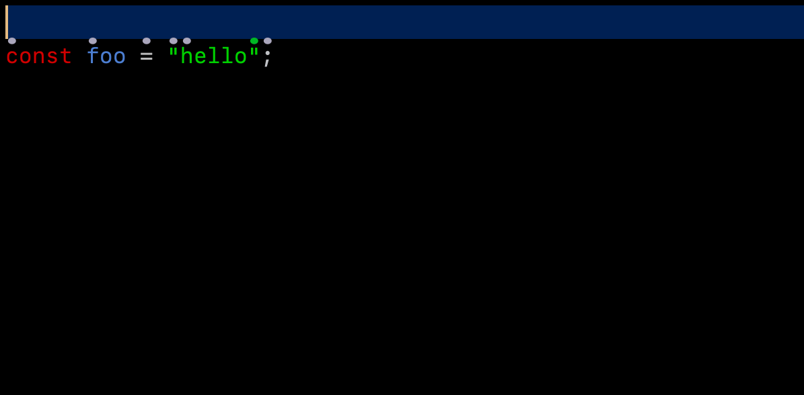

<!-- markdown-link-check-disable -->

# Change Log

All notable changes to the "cursorless" extension will be documented in this file.

## [0.25.0](https://github.com/cursorless-dev/cursorless/tree/0.25.0) (2022-01-09)

[Full Changelog](https://github.com/cursorless-dev/cursorless/compare/0.24.2...0.25.0)

### Highlights

#### New languages

- Preliminary Scala support [\#399](https://github.com/cursorless-dev/cursorless/pull/399) ([SCdF](https://github.com/SCdF))

#### Improved Jupyter notebook support

We're beefing up our support for Jupyter notebooks. This release adds support for cross-cell cursor movement:

Expect [more](https://github.com/cursorless-dev/cursorless/issues/422) cool [stuff](https://github.com/cursorless-dev/cursorless/issues/421) in future releases.

#### Miscellaneous

- You can now abbreviate `"slice past"` to just `"slice"`, eg `"pre air slice bat"` instead of `"pre air slice past bat"`

### Issues / PRs

**Fixed bugs:**

- Support moving cursor between cells in a notebook [\#420](https://github.com/cursorless-dev/cursorless/issues/420)
- Support "key" and "value" with javascript object property shorthand [\#369](https://github.com/cursorless-dev/cursorless/issues/369)
- fold/unfold requires funk modifier [\#72](https://github.com/cursorless-dev/cursorless/issues/72)
- Fix bug with "every funk" in private class function [\#22](https://github.com/cursorless-dev/cursorless/issues/22)

**Merged pull requests:**

- Configurable debounce delay [\#433](https://github.com/cursorless-dev/cursorless/pull/433) ([pokey](https://github.com/pokey))
- Cross-cell set selection [\#430](https://github.com/cursorless-dev/cursorless/pull/430) ([pokey](https://github.com/pokey))
- Hide decorations for selections that are larger than the viewport [\#403](https://github.com/cursorless-dev/cursorless/pull/403) ([AndreasArvidsson](https://github.com/AndreasArvidsson))
- Re enable fold single line [\#401](https://github.com/cursorless-dev/cursorless/pull/401) ([AndreasArvidsson](https://github.com/AndreasArvidsson))
- Scala support [\#399](https://github.com/cursorless-dev/cursorless/pull/399) ([SCdF](https://github.com/SCdF))
- Added support for user colors [\#386](https://github.com/cursorless-dev/cursorless/pull/386) and [\#132](https://github.com/pokey/cursorless-talon/pull/132) ([AndreasArvidsson](https://github.com/AndreasArvidsson))
- In typescript short hand property can be treated as key item or value [\#381](https://github.com/cursorless-dev/cursorless/pull/381) ([AndreasArvidsson](https://github.com/AndreasArvidsson))
- Made range connective implicit if range type is given [\#136](https://github.com/pokey/cursorless-talon/pull/136) ([AndreasArvidsson](https://github.com/AndreasArvidsson))

## [0.24.1](https://github.com/cursorless-dev/cursorless/tree/0.24.1) (2021-12-23)

[Full Changelog](https://github.com/cursorless-dev/cursorless/compare/0.24.0...0.24.1)

**Merged pull requests:**

- Fix html text fragment types [\#411](https://github.com/cursorless-dev/cursorless/pull/411) ([pokey](https://github.com/pokey))

## [0.24.0](https://github.com/cursorless-dev/cursorless/tree/0.24.0) (2021-12-21)

[Full Changelog](https://github.com/cursorless-dev/cursorless/compare/0.23.0...0.24.0)

### Highlights

#### New languages

- Go [\#391](https://github.com/cursorless-dev/cursorless/pull/391) ([trace-andreason](https://github.com/trace-andreason))
- HTML [\#385](https://github.com/cursorless-dev/cursorless/pull/385) ([AndreasArvidsson](https://github.com/AndreasArvidsson))
- Preliminary Clojure support [\#375](https://github.com/cursorless-dev/cursorless/pull/375) ([pokey](https://github.com/pokey))

#### `"Take round"`

We now support targets which consist of matching pairs of parentheses, square brackets, curly brackets, etc. These targets make cursorless a lot more useful in places where we don't have a parse tree, for example in markdown, plaintext or within a string or comment. See the [docs](https://github.com/pokey/cursorless-talon/blob/develop/docs/README.md#surrounding-pair) for more info, but in case you're one for GIFs:

And another one:

This scope type pairs nicely with the new `"repack"` action:

#### "Slice" ranges

We now support vertical ranges which put a selection on every line between the start and end of the range:

Here's a simple(-ish 😊) example:

And a more advanced one:

See the [demo video](https://youtu.be/TjdNoxn7FVc) for more.

#### Auto-joining targets

It is now possible to bring multiple sources to a single destination using the `"bring"` and `"move"` actions. The type of the source / destination will be used to determine how the sources are joined.

Here's an example where we bring multiple lines to the current cursor position:

And here's an example with an explicit destination:

#### And much more!

There's too much new stuff in this release to fit in a highlights reel, so we'll be releasing more videos, GIFs, and blurbs over the next couple weeks. In the meantime, below is a comprehensive list of PRs and issues included in this release.

### Issues / PRs

**Implemented enhancements:**

- Basic clojure support [\#373](https://github.com/cursorless-dev/cursorless/issues/373)
- Modifier that allows you to put cursor on column in every row between two targets [\#345](https://github.com/cursorless-dev/cursorless/issues/345)
- Support "round rewrap" action [\#270](https://github.com/cursorless-dev/cursorless/issues/270)
- Auto-join multiple targets with new lines [\#237](https://github.com/cursorless-dev/cursorless/issues/237)
- Add text-based surrounding pair implementation [\#218](https://github.com/cursorless-dev/cursorless/issues/218)
- Support auto-joining multiple arguments [\#184](https://github.com/cursorless-dev/cursorless/issues/184)
- Add "remove cursor" action [\#95](https://github.com/cursorless-dev/cursorless/issues/95)
- Support "enclosing \<symbol\>" transformation [\#14](https://github.com/cursorless-dev/cursorless/issues/14)
- Don't write `hat_styles.csv` if there was error reading VSCode settings [\#134](https://github.com/pokey/cursorless-talon/issues/134)
- Be more robust to not finding settings file [\#119](https://github.com/pokey/cursorless-talon/issues/119)
- Pop up notification when there is a problem finding / loading vscode settings [\#91](https://github.com/pokey/cursorless-talon/issues/91)
- Change some default terms [\#66](https://github.com/pokey/cursorless-talon/issues/66)

**Fixed bugs:**

- Text-based surrounding pair doesn't work in json strings [\#364](https://github.com/cursorless-dev/cursorless/issues/364)
- Angle bracket surrounding pair for type parameters in typescript [\#363](https://github.com/cursorless-dev/cursorless/issues/363)
- Fix Typescript text-based surrounding pairs [\#355](https://github.com/cursorless-dev/cursorless/issues/355)
- Hats don't show up when the line contains a `£` [\#315](https://github.com/cursorless-dev/cursorless/issues/315)
- Automatic token expansion doesn't work if token is offscreen [\#298](https://github.com/cursorless-dev/cursorless/issues/298)
- "chuck type" leaves trailing colon [\#281](https://github.com/cursorless-dev/cursorless/issues/281)
- Use time stamps for decorated marks [\#249](https://github.com/cursorless-dev/cursorless/issues/249)
- Improve and unify selection updating behaviour to handle overlapping ranges [\#138](https://github.com/cursorless-dev/cursorless/issues/138)
- Duplicate symbols after VS Code update [\#111](https://github.com/cursorless-dev/cursorless/issues/111)
- Fold action not working properly with multiple list elements [\#39](https://github.com/cursorless-dev/cursorless/issues/39)
- The `clear` command clashes with Knausj commands [\#68](https://github.com/pokey/cursorless-talon/issues/68)

**Closed issues:**

- Fix Windows CI regression [\#388](https://github.com/cursorless-dev/cursorless/issues/388)
- Add code links to hat snapshots doc [\#358](https://github.com/cursorless-dev/cursorless/issues/358)
- Add scope type for condition/guard [\#336](https://github.com/cursorless-dev/cursorless/issues/336)
- Get unit tests working again [\#16](https://github.com/cursorless-dev/cursorless/issues/16)
- Update scope type documentation [\#124](https://github.com/pokey/cursorless-talon/issues/124)
- Replace try/except with hasattr [\#117](https://github.com/pokey/cursorless-talon/issues/117)
- Not recognising colour/shape modifiers [\#100](https://github.com/pokey/cursorless-talon/issues/100)
- Cheatsheet surrounding pair delimiters; other improvements [\#67](https://github.com/pokey/cursorless-talon/issues/67)

**Merged pull requests:**

- Filter out single-line targets for `fold` action [\#400](https://github.com/cursorless-dev/cursorless/pull/400) ([pokey](https://github.com/pokey))
- Fix inside-outside for implicit targets [\#398](https://github.com/cursorless-dev/cursorless/pull/398) ([pokey](https://github.com/pokey))
- Upgrade tests [\#397](https://github.com/cursorless-dev/cursorless/pull/397) ([pokey](https://github.com/pokey))
- Handle angle brackets within an error node [\#396](https://github.com/cursorless-dev/cursorless/pull/396) ([pokey](https://github.com/pokey))
- Allow to fold single line [\#394](https://github.com/cursorless-dev/cursorless/pull/394) ([AndreasArvidsson](https://github.com/AndreasArvidsson))
- Adding Language Support for Go [\#391](https://github.com/cursorless-dev/cursorless/pull/391) ([trace-andreason](https://github.com/trace-andreason))
- Added default configuration for padding top [\#390](https://github.com/cursorless-dev/cursorless/pull/390) ([AndreasArvidsson](https://github.com/AndreasArvidsson))
- Allow non-yaml files in recorded tests dir [\#387](https://github.com/cursorless-dev/cursorless/pull/387) ([pokey](https://github.com/pokey))
- Added html language implementation [\#385](https://github.com/cursorless-dev/cursorless/pull/385) ([AndreasArvidsson](https://github.com/AndreasArvidsson))
- Fixed selection bug and added source mark to copy lines [\#384](https://github.com/cursorless-dev/cursorless/pull/384) ([AndreasArvidsson](https://github.com/AndreasArvidsson))
- Only show debug log in development mode [\#380](https://github.com/cursorless-dev/cursorless/pull/380) ([AndreasArvidsson](https://github.com/AndreasArvidsson))
- Reworked decorations debounce delay with special exception for scrolling [\#377](https://github.com/cursorless-dev/cursorless/pull/377) ([AndreasArvidsson](https://github.com/AndreasArvidsson))
- Added support for user define custom actions [\#376](https://github.com/cursorless-dev/cursorless/pull/376) ([AndreasArvidsson](https://github.com/AndreasArvidsson))
- Preliminary clojure support [\#375](https://github.com/cursorless-dev/cursorless/pull/375) ([pokey](https://github.com/pokey))
- Include generic in java type definition [\#372](https://github.com/cursorless-dev/cursorless/pull/372) ([AndreasArvidsson](https://github.com/AndreasArvidsson))
- Fix doc links [\#371](https://github.com/cursorless-dev/cursorless/pull/371) ([pokey](https://github.com/pokey))
- Fix JSON surrounding pairs [\#370](https://github.com/cursorless-dev/cursorless/pull/370) ([pokey](https://github.com/pokey))
- Added a rebounce delay setting [\#368](https://github.com/cursorless-dev/cursorless/pull/368) ([AndreasArvidsson](https://github.com/AndreasArvidsson))
- Fix typescript angle bracket pair [\#367](https://github.com/cursorless-dev/cursorless/pull/367) ([pokey](https://github.com/pokey))
- Add rewrap action [\#365](https://github.com/cursorless-dev/cursorless/pull/365) ([pokey](https://github.com/pokey))
- Add hat snapshot documentation code links [\#362](https://github.com/cursorless-dev/cursorless/pull/362) ([pokey](https://github.com/pokey))
- Disabled statement block on typescript [\#359](https://github.com/cursorless-dev/cursorless/pull/359) ([AndreasArvidsson](https://github.com/AndreasArvidsson))
- Change column modified to range vertical connector [\#353](https://github.com/cursorless-dev/cursorless/pull/353) ([AndreasArvidsson](https://github.com/AndreasArvidsson))
- Implemented strict here selection type [\#352](https://github.com/cursorless-dev/cursorless/pull/352) ([AndreasArvidsson](https://github.com/AndreasArvidsson))
- Column selection type [\#351](https://github.com/cursorless-dev/cursorless/pull/351) ([AndreasArvidsson](https://github.com/AndreasArvidsson))
- Add wrapper to avoid multiple done calls [\#350](https://github.com/cursorless-dev/cursorless/pull/350) ([pokey](https://github.com/pokey))
- Increase number of test retries [\#349](https://github.com/cursorless-dev/cursorless/pull/349) ([pokey](https://github.com/pokey))
- Added action remove selection [\#348](https://github.com/cursorless-dev/cursorless/pull/348) ([AndreasArvidsson](https://github.com/AndreasArvidsson))
- Delimiter selector updated [\#347](https://github.com/cursorless-dev/cursorless/pull/347) ([AndreasArvidsson](https://github.com/AndreasArvidsson))
- Fix spinning unmatched delimiter [\#343](https://github.com/cursorless-dev/cursorless/pull/343) ([pokey](https://github.com/pokey))
- Added specific typescript type selector [\#342](https://github.com/cursorless-dev/cursorless/pull/342) ([AndreasArvidsson](https://github.com/AndreasArvidsson))
- Added conditions scope type [\#341](https://github.com/cursorless-dev/cursorless/pull/341) ([AndreasArvidsson](https://github.com/AndreasArvidsson))
- Updated leading and trailing delimiters for before and after positions [\#340](https://github.com/cursorless-dev/cursorless/pull/340) ([AndreasArvidsson](https://github.com/AndreasArvidsson))
- Join sources on single destination [\#339](https://github.com/cursorless-dev/cursorless/pull/339) ([AndreasArvidsson](https://github.com/AndreasArvidsson))
- Removed additional highlight before scroll [\#337](https://github.com/cursorless-dev/cursorless/pull/337) ([AndreasArvidsson](https://github.com/AndreasArvidsson))
- Implementation of modulo line numbers [\#333](https://github.com/cursorless-dev/cursorless/pull/333) ([AndreasArvidsson](https://github.com/AndreasArvidsson))
- Regex updates [\#326](https://github.com/cursorless-dev/cursorless/pull/326) ([AndreasArvidsson](https://github.com/AndreasArvidsson))
- Textual paired delimiters [\#324](https://github.com/cursorless-dev/cursorless/pull/324) ([pokey](https://github.com/pokey))
- Hat snapshots [\#318](https://github.com/cursorless-dev/cursorless/pull/318) ([pokey](https://github.com/pokey))
- Dispose of decorations [\#307](https://github.com/cursorless-dev/cursorless/pull/307) ([pokey](https://github.com/pokey))
- Improved update selections [\#306](https://github.com/cursorless-dev/cursorless/pull/306) ([pokey](https://github.com/pokey))
  Avoid updating CSV on error reading VSCode settings [\#137](https://github.com/pokey/cursorless-talon/pull/137) ([pokey](https://github.com/pokey))
- Fix rewrap in cheatsheet [\#133](https://github.com/pokey/cursorless-talon/pull/133) ([pokey](https://github.com/pokey))
- Some cheatsheet improvements [\#129](https://github.com/pokey/cursorless-talon/pull/129) ([pokey](https://github.com/pokey))
- Settings file robustness [\#128](https://github.com/pokey/cursorless-talon/pull/128) ([pokey](https://github.com/pokey))
- Update scope type documentation [\#127](https://github.com/pokey/cursorless-talon/pull/127) ([pokey](https://github.com/pokey))
- Added support for user define custom actions [\#125](https://github.com/pokey/cursorless-talon/pull/125) ([AndreasArvidsson](https://github.com/AndreasArvidsson))
- Change default terms [\#123](https://github.com/pokey/cursorless-talon/pull/123) ([pokey](https://github.com/pokey))
- Black CI [\#122](https://github.com/pokey/cursorless-talon/pull/122) ([pokey](https://github.com/pokey))
- Csv pipe [\#121](https://github.com/pokey/cursorless-talon/pull/121) ([AndreasArvidsson](https://github.com/AndreasArvidsson))
- Add rewrap action [\#120](https://github.com/pokey/cursorless-talon/pull/120) ([pokey](https://github.com/pokey))
- Ignore settings [\#118](https://github.com/pokey/cursorless-talon/pull/118) ([AndreasArvidsson](https://github.com/AndreasArvidsson))
- Changed column modified to range vertical connector [\#116](https://github.com/pokey/cursorless-talon/pull/116) ([AndreasArvidsson](https://github.com/AndreasArvidsson))
- Added identity modifier. Added head tail modifier to csv [\#115](https://github.com/pokey/cursorless-talon/pull/115) ([AndreasArvidsson](https://github.com/AndreasArvidsson))
- Added strict here selection type [\#114](https://github.com/pokey/cursorless-talon/pull/114) ([AndreasArvidsson](https://github.com/AndreasArvidsson))
- Column selection type [\#113](https://github.com/pokey/cursorless-talon/pull/113) ([AndreasArvidsson](https://github.com/AndreasArvidsson))
- Added action remove selection [\#110](https://github.com/pokey/cursorless-talon/pull/110) ([AndreasArvidsson](https://github.com/AndreasArvidsson))
- Added conditions scope type [\#108](https://github.com/pokey/cursorless-talon/pull/108) ([AndreasArvidsson](https://github.com/AndreasArvidsson))
- Moved wrap action to talon file [\#106](https://github.com/pokey/cursorless-talon/pull/106) ([AndreasArvidsson](https://github.com/AndreasArvidsson))
- Implementation of modulo line numbers [\#105](https://github.com/pokey/cursorless-talon/pull/105) ([AndreasArvidsson](https://github.com/AndreasArvidsson))
- Improve surrounding pairs [\#104](https://github.com/pokey/cursorless-talon/pull/104) ([pokey](https://github.com/pokey))
- Take snapshots of hat map [\#101](https://github.com/pokey/cursorless-talon/pull/101) ([pokey](https://github.com/pokey))

## [0.23.0](https://github.com/cursorless-dev/cursorless/tree/0.23.0) (2021-10-27)

[Full Changelog](https://github.com/cursorless-dev/cursorless/compare/0.22.0...0.23.0)

### Highlights

#### \[experimental\] Wrap with snippet

There is now experimental support for wrapping a target in a snippet. See the [docs](https://www.cursorless.org/docs/user/experimental/wrapper-snippets/) for more info. Expect snippet insertion and automatic snippet creation in the next release.

### Issues / PRs

**Implemented enhancements:**

- Support "wrap with snippet" [\#21](https://github.com/cursorless-dev/cursorless/issues/21)

**Closed issues:**

- Change inference rule for “bring \<mark\> to \<scopeType\>” [\#283](https://github.com/cursorless-dev/cursorless/issues/283)

**Merged pull requests:**

- Stop using end of range as inference source [\#301](https://github.com/cursorless-dev/cursorless/pull/301) ([pokey](https://github.com/pokey))
- Change mark inference [\#300](https://github.com/cursorless-dev/cursorless/pull/300) ([pokey](https://github.com/pokey))
- Snippet wrap [\#296](https://github.com/cursorless-dev/cursorless/pull/296) ([pokey](https://github.com/pokey))
- Tweak svg files [\#290](https://github.com/cursorless-dev/cursorless/pull/290) ([pokey](https://github.com/pokey))
- Snippet wrap [\#94](https://github.com/pokey/cursorless-talon/pull/94) ([pokey](https://github.com/pokey))

## [0.22.0](https://github.com/cursorless-dev/cursorless/tree/0.22.0) (2021-10-06)

[Full Changelog](https://github.com/cursorless-dev/cursorless/compare/0.21.0...0.22.0)

### Highlights

#### Customizing spoken forms by csv

One of the biggest changes in this release is support for
[customizing](https://www.cursorless.org/docs/user/customization/)
nearly every spoken form via csv. So if you find the color name "plum" hard to
remember, you can just change it to "pink". Or if "format" as an action name is
just too long for you, change it to "form". The spoken forms in your csv's
will be preserved across cursorless updates, even if we change the default
spoken form going forward.

If you have a fork of cursorless-talon just to change some spoken forms, please
try
out the new csv's! Should make updating cursorless-talon much easier in the
future 😊. If you still need to maintain a fork for some other reason, please
[file an
issue](https://github.com/pokey/cursorless-talon/issues/new). We'd like cursorless-talon to be the same for all users, so that
we can move to a talon plugin model in the future.

#### Extra shapes

Another major usability issue addressed in this release is the fact that you
will run out of dots on a text-heavy screen, or when trying to target other
splits. We now support 10 new
[shapes](https://www.cursorless.org/docs/#shapes).
You can turn them on with one click in your extension settings, as described in
the
[docs](https://www.cursorless.org/docs/#shapes).
And of course, you can [change the spoken
form](https://www.cursorless.org/docs/user/customization/)
for any shape as described above.

#### Turning off colors

If you find it difficult to distinguish the colors, and tweaking them doesn't work, you can just turn some colors off with one click in the same way you turn shapes on / off. Adding a couple of shapes will more than make up for the lost hats.

#### Fix bug with click target area

There was a bug where cursorless hats would obstruct the target area when clicking with the mouse. This issue didn't affect cursorless operation, but was quite painful when using a mouse / eyetracker. That issue is now fixed.

### Gotchas

- You may need to tweak your hat sizes, because we made a fix to the algorithm
  that computes them based on font size

### Issues / PRs

**Implemented enhancements:**

- Invert color settings [\#271](https://github.com/cursorless-dev/cursorless/issues/271)
- Do one more pass at shapes and colors [\#269](https://github.com/cursorless-dev/cursorless/issues/269)
- Treat hex colors as single tokens [\#266](https://github.com/cursorless-dev/cursorless/issues/266)
- Regular expression splits words with swedish characters [\#252](https://github.com/cursorless-dev/cursorless/issues/252)
- Add modifier preferences support [\#230](https://github.com/cursorless-dev/cursorless/issues/230)
- Implement delimiter generators for "change" [\#219](https://github.com/cursorless-dev/cursorless/issues/219)
- Switch svg colour code to use themes properly [\#212](https://github.com/cursorless-dev/cursorless/issues/212)
- Add action term override csv [\#40](https://github.com/pokey/cursorless-talon/issues/40)

**Fixed bugs:**

- "take every value" is broken in python [\#257](https://github.com/cursorless-dev/cursorless/issues/257)
- SVG hat obstructs click target area [\#110](https://github.com/cursorless-dev/cursorless/issues/110)
- Fix decoration appearing after GitLens Current Line Blame [\#92](https://github.com/cursorless-dev/cursorless/issues/92)

**Closed issues:**

- Move token scope type code out of navigation map [\#236](https://github.com/cursorless-dev/cursorless/issues/236)
- Filter out duplicate selections [\#228](https://github.com/cursorless-dev/cursorless/issues/228)
- Set decoration sleep timeout to 0 during tests [\#175](https://github.com/cursorless-dev/cursorless/issues/175)
- Fix nondeterministic test failures [\#173](https://github.com/cursorless-dev/cursorless/issues/173)
- Review all identifiers [\#62](https://github.com/pokey/cursorless-talon/issues/62)
- Add missing things to cheatsheet [\#17](https://github.com/pokey/cursorless-talon/issues/17)

**Merged pull requests:**

- Support value for return value [\#285](https://github.com/cursorless-dev/cursorless/pull/285) ([pokey](https://github.com/pokey))
- Support multiple destinations for call action [\#284](https://github.com/cursorless-dev/cursorless/pull/284) ([pokey](https://github.com/pokey))
- Invert color settings [\#280](https://github.com/cursorless-dev/cursorless/pull/280) ([pokey](https://github.com/pokey))
- Support triple backtick [\#279](https://github.com/cursorless-dev/cursorless/pull/279) ([pokey](https://github.com/pokey))
- Put identifier before repeatable symbols [\#278](https://github.com/cursorless-dev/cursorless/pull/278) ([AndreasArvidsson](https://github.com/AndreasArvidsson))
- Add new hats and preprocessing script [\#277](https://github.com/cursorless-dev/cursorless/pull/277) ([pokey](https://github.com/pokey))
- Added support for unicode characters in regular expression [\#275](https://github.com/cursorless-dev/cursorless/pull/275) ([AndreasArvidsson](https://github.com/AndreasArvidsson))
- Added triple quote to regular expression [\#274](https://github.com/cursorless-dev/cursorless/pull/274) ([AndreasArvidsson](https://github.com/AndreasArvidsson))
- Fix SVG alignment and click box [\#273](https://github.com/cursorless-dev/cursorless/pull/273) ([pokey](https://github.com/pokey))
- Fix color tokens [\#268](https://github.com/cursorless-dev/cursorless/pull/268) ([pokey](https://github.com/pokey))
- Tweak default colors [\#267](https://github.com/cursorless-dev/cursorless/pull/267) ([pokey](https://github.com/pokey))
- Rename purple to pink [\#263](https://github.com/cursorless-dev/cursorless/pull/263) ([pokey](https://github.com/pokey))
- master =\> main [\#262](https://github.com/cursorless-dev/cursorless/pull/262) ([pokey](https://github.com/pokey))
- Add suffixedMatcher; use for keys [\#260](https://github.com/cursorless-dev/cursorless/pull/260) ([pokey](https://github.com/pokey))
- Fix "take every value" in python [\#258](https://github.com/cursorless-dev/cursorless/pull/258) ([pokey](https://github.com/pokey))
- Add a bunch of new hats [\#256](https://github.com/cursorless-dev/cursorless/pull/256) ([pokey](https://github.com/pokey))
- Fix copy when focus is not on editor [\#255](https://github.com/cursorless-dev/cursorless/pull/255) ([pokey](https://github.com/pokey))
- Multiple hat styles [\#253](https://github.com/cursorless-dev/cursorless/pull/253) ([pokey](https://github.com/pokey))
- Renames for csv overrides PR [\#248](https://github.com/cursorless-dev/cursorless/pull/248) ([pokey](https://github.com/pokey))
- Add cell selection type [\#246](https://github.com/cursorless-dev/cursorless/pull/246) ([pokey](https://github.com/pokey))
- Improve badges [\#245](https://github.com/cursorless-dev/cursorless/pull/245) ([pokey](https://github.com/pokey))
- Retry tests and remove sleep [\#239](https://github.com/cursorless-dev/cursorless/pull/239) ([pokey](https://github.com/pokey))
- General cleanup [\#235](https://github.com/cursorless-dev/cursorless/pull/235) ([AndreasArvidsson](https://github.com/AndreasArvidsson))
- Fix anonymous functions [\#232](https://github.com/cursorless-dev/cursorless/pull/232) ([pokey](https://github.com/pokey))
- Fix VSCode settings watch [\#85](https://github.com/pokey/cursorless-talon/pull/85) ([pokey](https://github.com/pokey))
- Fix broken shape [\#84](https://github.com/pokey/cursorless-talon/pull/84) ([pokey](https://github.com/pokey))
- Patch from main [\#82](https://github.com/pokey/cursorless-talon/pull/82) ([pokey](https://github.com/pokey))
- Turn hats off by default; add 'play' hat [\#80](https://github.com/pokey/cursorless-talon/pull/80) ([pokey](https://github.com/pokey))
- Fix typos [\#76](https://github.com/pokey/cursorless-talon/pull/76) ([devnll](https://github.com/devnll))
- Rename purple to pink [\#75](https://github.com/pokey/cursorless-talon/pull/75) ([pokey](https://github.com/pokey))
- master =\> main [\#74](https://github.com/pokey/cursorless-talon/pull/74) ([pokey](https://github.com/pokey))
- Add new shape documentation [\#73](https://github.com/pokey/cursorless-talon/pull/73) ([pokey](https://github.com/pokey))
- Add `revealTypeDefinition` action [\#72](https://github.com/pokey/cursorless-talon/pull/72) ([pokey](https://github.com/pokey))
- Add a bunch of new hats [\#71](https://github.com/pokey/cursorless-talon/pull/71) ([pokey](https://github.com/pokey))
- Fix cheat sheet [\#70](https://github.com/pokey/cursorless-talon/pull/70) ([pokey](https://github.com/pokey))
- hat-shapes [\#69](https://github.com/pokey/cursorless-talon/pull/69) ([pokey](https://github.com/pokey))
- csv overrides [\#63](https://github.com/pokey/cursorless-talon/pull/63) ([AndreasArvidsson](https://github.com/AndreasArvidsson))

## [0.21.0](https://github.com/cursorless-dev/cursorless/tree/0.21.0) (2021-08-17)

[Full Changelog](https://github.com/cursorless-dev/cursorless/compare/0.20.0...0.21.0)

**Implemented enhancements:**

- Improve error messages for sub token modifiers [\#201](https://github.com/cursorless-dev/cursorless/issues/201)
- Rename `xmlAttribute` scope type to `attribute` [\#198](https://github.com/cursorless-dev/cursorless/issues/198)
- Change highlight for insert new empty line [\#139](https://github.com/cursorless-dev/cursorless/issues/139)
- Add "source" mark [\#107](https://github.com/cursorless-dev/cursorless/issues/107)
- Add "reversed" modifier [\#99](https://github.com/cursorless-dev/cursorless/issues/99)
- Add "reverse" action [\#98](https://github.com/cursorless-dev/cursorless/issues/98)
- Add "sort" action [\#97](https://github.com/cursorless-dev/cursorless/issues/97)
- Scope modifier for regex [\#89](https://github.com/cursorless-dev/cursorless/issues/89)
- Support `"map"` and `"item"` modifiers for pattern destructuring [\#85](https://github.com/cursorless-dev/cursorless/issues/85)
- Support "reformat as" action [\#74](https://github.com/cursorless-dev/cursorless/issues/74)
- Support head and tail modifiers [\#70](https://github.com/cursorless-dev/cursorless/issues/70)
- Support duplication of lines [\#55](https://github.com/cursorless-dev/cursorless/issues/55)
- Support numeric ranges for insert [\#48](https://github.com/cursorless-dev/cursorless/issues/48)
- Support absolute line number mark [\#44](https://github.com/cursorless-dev/cursorless/issues/44)
- Standardize and align on terms for map entries and list elements [\#40](https://github.com/cursorless-dev/cursorless/issues/40)
- Support "call" action [\#38](https://github.com/cursorless-dev/cursorless/issues/38)
- Add "phones" action [\#31](https://github.com/cursorless-dev/cursorless/issues/31)
- Support "replace with" action [\#15](https://github.com/cursorless-dev/cursorless/issues/15)
- Support subword for token containing cursor [\#10](https://github.com/cursorless-dev/cursorless/issues/10)
- Infer type of first swap argument [\#8](https://github.com/cursorless-dev/cursorless/issues/8)

**Fixed bugs:**

- "Value" scope type in Python doesn't work when value contains array index [\#223](https://github.com/cursorless-dev/cursorless/issues/223)
- "Take past end of token" doesn't work [\#222](https://github.com/cursorless-dev/cursorless/issues/222)
- "token" modifier doesn't work with ranges [\#221](https://github.com/cursorless-dev/cursorless/issues/221)
- "take every key" and "take every value" are broken [\#220](https://github.com/cursorless-dev/cursorless/issues/220)
- "Chuck past end of T" removes trailing delimiter [\#209](https://github.com/cursorless-dev/cursorless/issues/209)
- Containing token inference doesn't work next to single-character token [\#200](https://github.com/cursorless-dev/cursorless/issues/200)
- "float" highlights wrong line when applied to last line of file [\#197](https://github.com/cursorless-dev/cursorless/issues/197)
- Breakpoint action not working on mac [\#195](https://github.com/cursorless-dev/cursorless/issues/195)
- "take block" ends up with reversed selection [\#155](https://github.com/cursorless-dev/cursorless/issues/155)
- "dupe block" should add an extra newline before the new block [\#154](https://github.com/cursorless-dev/cursorless/issues/154)
- "Pour block" creates new line after the wrong line [\#153](https://github.com/cursorless-dev/cursorless/issues/153)
- Space delimiter code is too aggressive [\#152](https://github.com/cursorless-dev/cursorless/issues/152)
- `"arg"` modifier doesn't work in javascript [\#109](https://github.com/cursorless-dev/cursorless/issues/109)
- Support Javascript template literals for string scope [\#86](https://github.com/cursorless-dev/cursorless/issues/86)
- Fix function transformation in Typescript with "export default" [\#20](https://github.com/cursorless-dev/cursorless/issues/20)
- Merge sequential pending change highlights [\#2](https://github.com/cursorless-dev/cursorless/issues/2)

**Closed issues:**

- Switch to flow-style for simple objects in test yaml dump [\#161](https://github.com/cursorless-dev/cursorless/issues/161)
- Implement scope modifier for argument name [\#144](https://github.com/cursorless-dev/cursorless/issues/144)
- Add documentation for how to add a new language [\#132](https://github.com/cursorless-dev/cursorless/issues/132)
- Change "copy", "paste" and "cut" actions by moving selection and using built-ins [\#127](https://github.com/cursorless-dev/cursorless/issues/127)
- Error: Cannot read property 'rootNode' of undefined [\#113](https://github.com/cursorless-dev/cursorless/issues/113)
- Make test case recorder [\#59](https://github.com/cursorless-dev/cursorless/issues/59)
- "token" selection type should expand to nearest containing token [\#37](https://github.com/cursorless-dev/cursorless/issues/37)
- Change “if” to “if state” [\#50](https://github.com/pokey/cursorless-talon/issues/50)
- Try “pre” instead of “pree” [\#22](https://github.com/pokey/cursorless-talon/issues/22)

**Merged pull requests:**

- Fixed bug with array in pair value [\#241](https://github.com/cursorless-dev/cursorless/pull/241) ([AndreasArvidsson](https://github.com/AndreasArvidsson))
- Fix cross-split selections [\#233](https://github.com/cursorless-dev/cursorless/pull/233) ([pokey](https://github.com/pokey))
- Bugfixes: past token, past end of, subtoken out of range, sort tokens [\#229](https://github.com/cursorless-dev/cursorless/pull/229) ([AndreasArvidsson](https://github.com/AndreasArvidsson))
- Check ancestors for every [\#227](https://github.com/cursorless-dev/cursorless/pull/227) ([AndreasArvidsson](https://github.com/AndreasArvidsson))
- Add newlines to end of yaml test cases [\#226](https://github.com/cursorless-dev/cursorless/pull/226) ([pokey](https://github.com/pokey))
- Added matching backtick quotes [\#211](https://github.com/cursorless-dev/cursorless/pull/211) ([AndreasArvidsson](https://github.com/AndreasArvidsson))
- Let parse tree errors through [\#207](https://github.com/cursorless-dev/cursorless/pull/207) ([pokey](https://github.com/pokey))
- Updated how line decorations are shown [\#194](https://github.com/cursorless-dev/cursorless/pull/194) ([AndreasArvidsson](https://github.com/AndreasArvidsson))
- Add docs for adding a new language [\#187](https://github.com/cursorless-dev/cursorless/pull/187) ([pokey](https://github.com/pokey))
- Add support for C++ [\#186](https://github.com/cursorless-dev/cursorless/pull/186) ([dgrunwald](https://github.com/dgrunwald))
- Treat line numbers as proper marks [\#180](https://github.com/cursorless-dev/cursorless/pull/180) ([AndreasArvidsson](https://github.com/AndreasArvidsson))
- docs cleanup [\#179](https://github.com/cursorless-dev/cursorless/pull/179) ([pokey](https://github.com/pokey))
- Added tests for head, tail and line numbers [\#178](https://github.com/cursorless-dev/cursorless/pull/178) ([AndreasArvidsson](https://github.com/AndreasArvidsson))
- Added documentation for test recorder [\#177](https://github.com/cursorless-dev/cursorless/pull/177) ([AndreasArvidsson](https://github.com/AndreasArvidsson))
- Test on PR and push to master [\#172](https://github.com/cursorless-dev/cursorless/pull/172) ([brxck](https://github.com/brxck))
- Converted test recorder for bulk recordings [\#169](https://github.com/cursorless-dev/cursorless/pull/169) ([AndreasArvidsson](https://github.com/AndreasArvidsson))
- Add surrounding pair modifier \(\#3\) [\#168](https://github.com/cursorless-dev/cursorless/pull/168) ([maciejklimek](https://github.com/maciejklimek))
- Declarative language definition [\#151](https://github.com/cursorless-dev/cursorless/pull/151) ([AndreasArvidsson](https://github.com/AndreasArvidsson))
- Don't do inference from end to start [\#143](https://github.com/cursorless-dev/cursorless/pull/143) ([AndreasArvidsson](https://github.com/AndreasArvidsson))
- Added action replace [\#135](https://github.com/cursorless-dev/cursorless/pull/135) ([AndreasArvidsson](https://github.com/AndreasArvidsson))
- Test Case Recorder [\#87](https://github.com/cursorless-dev/cursorless/pull/87) ([brxck](https://github.com/brxck))
- Fix cheat sheet [\#60](https://github.com/pokey/cursorless-talon/pull/60) ([pokey](https://github.com/pokey))
- Attempt to optimize dfa [\#57](https://github.com/pokey/cursorless-talon/pull/57) ([pokey](https://github.com/pokey))
- Add surrouding_pair modifier [\#55](https://github.com/pokey/cursorless-talon/pull/55) ([maciejklimek](https://github.com/maciejklimek))
- Add action inspect; rename several actions [\#54](https://github.com/pokey/cursorless-talon/pull/54) ([AndreasArvidsson](https://github.com/AndreasArvidsson))
- Cheat sheet bug: Updated with new list name [\#53](https://github.com/pokey/cursorless-talon/pull/53) ([AndreasArvidsson](https://github.com/AndreasArvidsson))
- Switch subtoken to ordinals_small [\#52](https://github.com/pokey/cursorless-talon/pull/52) ([pokey](https://github.com/pokey))
- Updated cheat sheet with new actions and modifiers [\#49](https://github.com/pokey/cursorless-talon/pull/49) ([AndreasArvidsson](https://github.com/AndreasArvidsson))
- Updates to actions and modifiers [\#48](https://github.com/pokey/cursorless-talon/pull/48) ([AndreasArvidsson](https://github.com/AndreasArvidsson))
- Added spoken form to API [\#46](https://github.com/pokey/cursorless-talon/pull/46) ([AndreasArvidsson](https://github.com/AndreasArvidsson))
- Added modifiers row up down [\#44](https://github.com/pokey/cursorless-talon/pull/44) ([AndreasArvidsson](https://github.com/AndreasArvidsson))
- Added action call [\#43](https://github.com/pokey/cursorless-talon/pull/43) ([AndreasArvidsson](https://github.com/AndreasArvidsson))
- Added source mark [\#42](https://github.com/pokey/cursorless-talon/pull/42) ([AndreasArvidsson](https://github.com/AndreasArvidsson))
- Added actions sort and reverse [\#41](https://github.com/pokey/cursorless-talon/pull/41) ([AndreasArvidsson](https://github.com/AndreasArvidsson))
- Added modifiers head and tail [\#39](https://github.com/pokey/cursorless-talon/pull/39) ([AndreasArvidsson](https://github.com/AndreasArvidsson))
- Updated scope modifiers [\#37](https://github.com/pokey/cursorless-talon/pull/37) ([AndreasArvidsson](https://github.com/AndreasArvidsson))
- Expand sub piece to token [\#36](https://github.com/pokey/cursorless-talon/pull/36) ([AndreasArvidsson](https://github.com/AndreasArvidsson))
- Added actions: replace, phones, formatter, find [\#33](https://github.com/pokey/cursorless-talon/pull/33) ([AndreasArvidsson](https://github.com/AndreasArvidsson))

## 0.20.0 (24 July 2021)

### Enhancements

- C\# support [\#137](https://github.com/cursorless-dev/cursorless/pull/137) ([sterlind](https://github.com/sterlind))
- Added action duplicate [\#134](https://github.com/cursorless-dev/cursorless/pull/134) ([AndreasArvidsson](https://github.com/AndreasArvidsson))
- Added support to exclude start or end token in ranges [\#131](https://github.com/cursorless-dev/cursorless/pull/131) ([AndreasArvidsson](https://github.com/AndreasArvidsson))
- Added action set breakpoint [\#130](https://github.com/cursorless-dev/cursorless/pull/130) ([AndreasArvidsson](https://github.com/AndreasArvidsson))
- Fixed bug with two adjacent tokens [\#129](https://github.com/cursorless-dev/cursorless/pull/129) ([AndreasArvidsson](https://github.com/AndreasArvidsson))
- Added selection type paragraph [\#125](https://github.com/cursorless-dev/cursorless/pull/125) ([AndreasArvidsson](https://github.com/AndreasArvidsson))
- implemented actions puff, float, drop [\#122](https://github.com/cursorless-dev/cursorless/pull/122) ([AndreasArvidsson](https://github.com/AndreasArvidsson))
- Subtokens support reversed order ordinals [\#121](https://github.com/cursorless-dev/cursorless/pull/121) ([AndreasArvidsson](https://github.com/AndreasArvidsson))
- added find all action [\#120](https://github.com/cursorless-dev/cursorless/pull/120) ([AndreasArvidsson](https://github.com/AndreasArvidsson))
- Infer missing end mark on ranges [\#118](https://github.com/cursorless-dev/cursorless/pull/118) ([AndreasArvidsson](https://github.com/AndreasArvidsson))
- Added actions: indent, dedent, comment [\#116](https://github.com/cursorless-dev/cursorless/pull/116) ([AndreasArvidsson](https://github.com/AndreasArvidsson))
- Implemented paste action [\#115](https://github.com/cursorless-dev/cursorless/pull/115) ([AndreasArvidsson](https://github.com/AndreasArvidsson))

### Bugs fixed

- Improved error message ensureSingleEditor [\#133](https://github.com/cursorless-dev/cursorless/pull/133) ([AndreasArvidsson](https://github.com/AndreasArvidsson))

### Code quality

- Added function listenForDocumentChanges [\#126](https://github.com/cursorless-dev/cursorless/pull/126) ([AndreasArvidsson](https://github.com/AndreasArvidsson))

## 0.19.0 (16 July 2021)

### Enhancements

- Support "move", "bring to after" / "move to after", and properly cleaning up spaces / newlines on delete

## 0.18.0 (12 July 2021)

### Enhancements

- Add support for untrusted workspaces ([#104](https://github.com/cursorless-dev/cursorless/pull/104))

## 0.17.0 (9 July 2021)

### Documentation

- Add cheatsheet (`"cursorless help"`) [cursorless-talon#1](https://github.com/pokey/cursorless-talon/pull/1)

## 0.16.0 (9 July 2021)

### Enhancements

- Svg Hats (#66)
- Add type modifier (#32)
- Updated regexp to support fixed tokens and sequential symbols (#33)
- Add name modifier (#56)
- Added actions to scroll target top/center (#58)

### Fixes

- Fix subword for all caps tokens (#67)

## 0.15.0

- Support "character" subtoken modifier (eg "take fine third character") (thanks @brxck!)

## 0.14.0

- Support `insertLineBefore` and `insertLineAfter` actions ("drink" and "pour")

## 0.13.0

- Support "file" selection type to refer to the entire file
- Improve error messages

## 0.12.0

- Add subword support
- [python] Fix parameter modifier
- Show exceptions to user
- Properly support using "token" to select only token, eg "take funk gust and
  token fine" to prevent "fine" from being inferred to have the `function`
  modifier.
- Support "bring" action to use another target from elsewhere in the document

## 0.11.0

- Simplify token regex

## 0.10.0

- Add Python support

## 0.9.0

- Support "string" and "comment" scope types

## 0.8.0

- Support "fold", "unfold", and "swap" actions

## 0.7.0

- Support "cut" action (default term in vscode-talon is "carve")

## 0.6.0

- Support "copy" action

## 0.5.0

- Support "that" to refer to previous target
- Support "extract" action to extract to constant

## 0.4.0

- Support pair key and value nodes
- Support selecting all siblings

## 0.3.0

- Support wrap

## 0.2.0

- Add support for arguments and pairs
