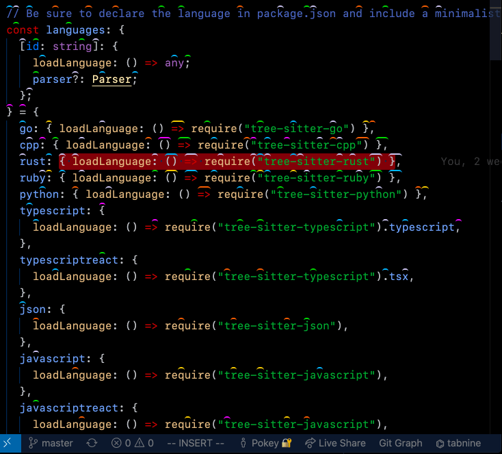
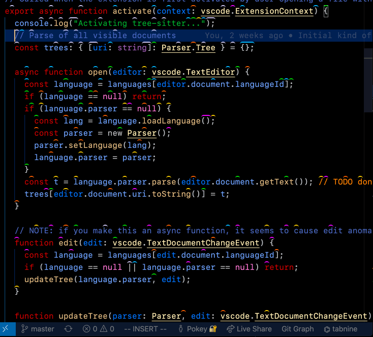

# Cursorless

Allows cursorless editing and rapid navigation by decorating a single letter
from each token.

## Features

Checkout the [docs](https://github.com/pokey/cursorless-talon/blob/master/docs), [tutorial video](https://www.youtube.com/watch?v=JxcNW0hnfTk) and [!!con talk](https://www.youtube.com/watch?v=Py9xjeIhxOg) to get started.

## Installation

Currently depends on [Talon](https://talonvoice.com/), though a keyboard
version is planned.

See [cursorless-talon](https://github.com/pokey/cursorless-talon) for installation instructions.

## Extension Settings

This extension contributes the following settings:

- `cursorless.showOnStart`: Whether decorations should appear on workspace start
- `cursorless.hatScaleFactor`: How much to scale the hats by
- `cursorless.hatVerticalOffset`: How much to vertically shift the hats as a percentage of font size; positive is up

## Known Issues

- Cursorless calculates the position of the hats based on the characteristics of your font. If you find that the hats are off center you can try running this command: `cursorless.recomputeDecorationStyles`

## Change Log

See [CHANGELOG.md](CHANGELOG.md).