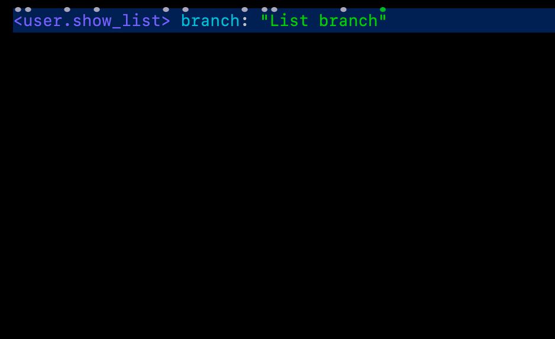
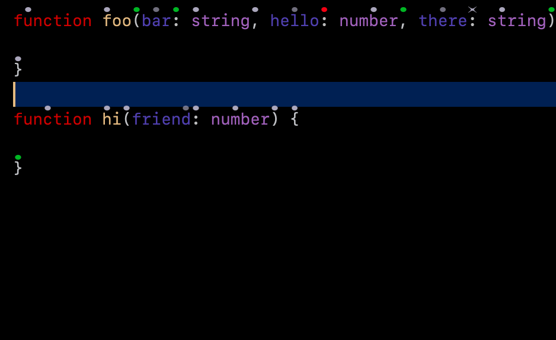
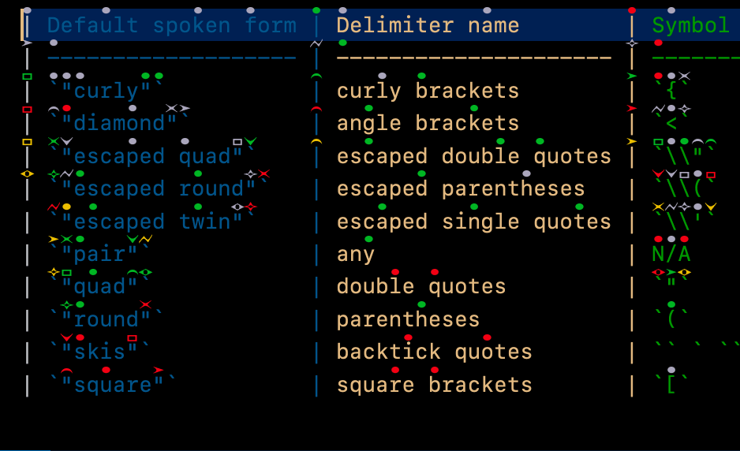

<h1 align="center">Welcome to Cursorless!</h1>

  
  
  
  
  
  

Cursorless is a spoken language for structural code editing, enabling developers to code by voice at speeds not possible with a keyboard. Cursorless decorates every token on the screen and defines a spoken language for rapid, high-level semantic manipulation of structured text.

Checkout the [docs](https://www.cursorless.org/docs/) and [videos](https://www.youtube.com/channel/UCML02pamUSxtbwAcrUdVmXg) to learn more. See [installation](https://www.cursorless.org/docs/user/installation/) for installation instructions.

And I heard you like GIFs?

## Installation

Currently depends on [Talon](https://talonvoice.com/), though a keyboard
version is planned.

See [installation](https://www.cursorless.org/docs/user/installation/) for installation instructions.

## Extension Settings

This extension contributes the following settings:

- `cursorless.showOnStart`: Whether decorations should appear on workspace start
- `cursorless.hatSizeAdjustment`: Percentage to increase or decrease hat size; positive increases size
- `cursorless.hatVerticalOffset`: How much to vertically shift the hats as a percentage of font size; positive is up
- `cursorless.hatEnablement.colors`: Whether to enable particular hat colors.
- `cursorless.hatEnablement.shapes`: Whether to enable particular hat shapes.
- `cursorless.hatPenalties.colors`: How much to penalize each hat color. You will probably want to set this one to the number of syllables in the given style. Cursorless will then sort every style combination by number of syllables to refer to it.
- `cursorless.hatPenalties.shapes`: How much to penalize each hat shape. You will probably want to set this one to the number of syllables in the given style. Cursorless will then sort every style combination by number of syllables to refer to it.
- `cursorless.maximumHatStylePenalty`: The maximum allowed penalty for a hat style. Any hat style whose penalty is greater than this amount will not be used. A hat style penalty is defined to be the shape penalty plus the colour penalty. Setting this value less than or equal to zero is treated as no maximum.

## Known Issues

- Cursorless calculates the position of the hats based on the characteristics of your font. If you find that the hats are off center you can try running this command: `cursorless.recomputeDecorationStyles`

## Contributing

See [contributing](https://www.cursorless.org/docs/contributing/).

## Change Log

See [CHANGELOG.md](CHANGELOG.md).

## Attributions

See [NOTICE.md](NOTICE.md).
