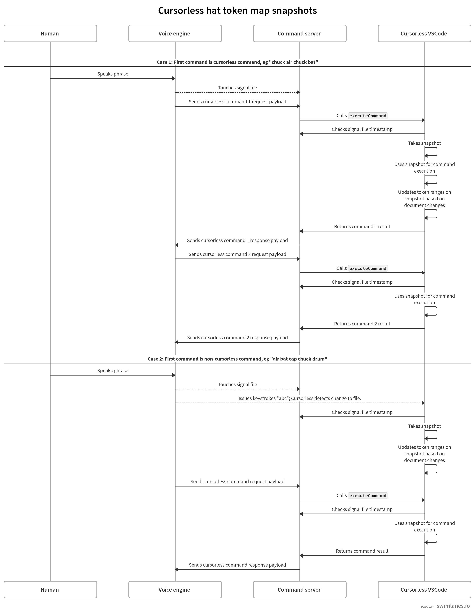

# Hat snapshots

In order to allow long chained command phrases, we take a snapshot of the hat token map at the start of a phrase and continue to use this map during the course of the entire phrase. This way you can be sure that any commands issued during the course of a single phrase that refer to a decorated token will continue to refer to the same logical token no matter what happens in the document during phrase execution. Note that the ranges of tokens will be kept current as the document changes so that they refer to the same logical range, but the same logical token will keep the same key in the hat token map over the course of a phrase.

To make this work, first the voice engine [touches](https://github.com/knausj85/knausj_talon/blob/e373780af16256ab8fd5638af32d97fa23c4c0fc/apps/vscode/command_client/command_client.py#L398) a file within the signals subdirectory of the command server communication directory after the phrase has been parsed but right before execution begins. Then cursorless will check the version of the signal file before it [reads](https://github.com/cursorless-dev/cursorless/blob/2a624888369d41b0531e472d001d63d09912c8aa/src/core/HatTokenMap.ts#L88) or [updates](https://github.com/cursorless-dev/cursorless/blob/0d1004bafc6764734bee62afbfbb02500630a264/src/core/HatTokenMap.ts#L70) the hat token map via the command server [signal API](https://github.com/pokey/command-server/blob/2b9f9ea2a38b6e95aa60ff9553a804165e527308/src/extension.ts#L29). If the signal has been emitted since the last time cursorless took a snapshot of the hat token map, it will take a new snapshot and continue to use that snapshot of the hats until the next time the signal is emitted. Note that the signal transmission is asynchronous so cursorless just needs to make sure to check the version of the signal before it either updates or reads the map.

In the diagram below, we document the flow of a couple different cases. Dotted lines represent asynchronous / fire-and-forget communication:

([diagram source](https://swimlanes.io/d/1KkgFFCtj))
