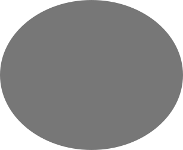
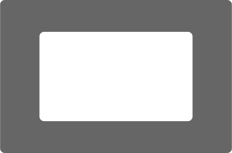
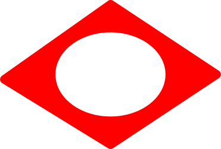

# Cursorless documentation

Welcome to Cursorless! You may find it helpful to start with the [tutorial video](https://www.youtube.com/watch?v=JxcNW0hnfTk).

This guide assumes you've already [installed Cursorless](installation.md).

Once you understand the concepts, you can pull up a cheatsheet for reference using the command `"cursorless help"`.

You can get back to these docs by saying `"cursorless instructions"`.

Note: If you'd like to customize any of the spoken forms, please see [Customization](customization.md).

## Overview

Every cursorless command consists of an action performed on a target. For example, the command `"chuck bat"` deletes the token with a hat over the `b`. In this command, the action is `"chuck"` (delete), and the target is `"bat"`. There are no actions without at least one target.


## Targets

There are two types of targets: primitive targets and compound targets. Compound targets are constructed from primitive targets, so let's begin with primitive targets.

### Primitive targets

A primitive target consists of a mark and one or more optional modifiers. The simplest primitive targets just consist of a mark without any modifiers, so let's begin with those

#### Marks

There are several types of marks:

##### Decorated symbol

This is the first type of mark you'll notice when you start using cursorless. You'll see that for every token on the screen, one of its characters will have a hat on top of it. We can refer to the given token by saying the name of the character that has a hat, along with the color if the hat is not gray, and the shape of the hat if the hat is not the default dot:

- `"air"` (if the color is gray)
- `"blue bat"`
- `"blue dash"`
- `"blue five"`
- `"fox bat"`
- `"blue fox bat"`

The general form of this type of mark is:

`"[<color>] [<shape>] (<letter> | <symbol> | <number>)"`

Combining this with an action, we might say `"take blue air"` to select the token containing letter `'a'` with a blue hat over it.

###### Colors

The following colors are supported. Note that to target the default (gray) hat you don't need to specify a color.

| Spoken form | Color   | Internal ID  | Enabled by default? |
| ----------- | ------- | ------------ | ------------------- |
| N/A         | grey    | `default`    | ✅                  |
| `"blue"`    | blue    | `blue`       | ✅                  |
| `"green"`   | green   | `green`      | ✅                  |
| `"red"`     | red     | `red`        | ✅                  |
| `"pink"`    | pink    | `pink`       | ✅                  |
| `"yellow"`  | yellow  | `yellow`     | ✅                  |
| `"navy"`    | navy    | `userColor1` | ❌                  |
| `"apricot"` | apricot | `userColor2` | ❌                  |

You can enable or disable colors in your VSCode settings, by searching for `cursorless.hatEnablement.colors` and checking the box next to the internal ID for the given shape as listed above.

You can also tweak the visible colors for any of these colors in your VSCode settings, by searching for `cursorless.colors` and changing the hex color code next to the internal ID for the given shape as listed above. Note that you can configure different colors for dark and light themes.

If you find these color names unintuitive / tough to remember, their
spoken forms can be [customized](customization.md) like any other spoken form
in Cursorless. If you change a spoken form to be more than one syllable, you
can change the penalty in the `cursorless.hatPenalties.colors` setting to the
number of syllables you use, so that Cursorless can optimize hat allocation to
minimize syllables.

###### Shapes

The following shapes are supported. Note that to target the default (dot) shape you don't need to specify a shape.

| Spoken form | Shape                                           | Internal ID  | Enabled by default? |
| ----------- | ----------------------------------------------- | ------------ | ------------------- |
| N/A         |        | `default`    | ✅                  |
| `"ex"`      |                  | `ex`         | ❌                  |
| `"fox"`     |                | `fox`        | ❌                  |
| `"wing"`    |              | `wing`       | ❌                  |
| `"hole"`    |              | `hole`       | ❌                  |
| `"frame"`   |            | `frame`      | ❌                  |
| `"curve"`   |            | `curve`      | ❌                  |
| `"eye"`     |                | `eye`        | ❌                  |
| `"play"`    |              | `play`       | ❌                  |
| `"cross"`   |  | `crosshairs` | ❌                  |
| `"bolt"`    |              | `bolt`       | ❌                  |

You can enable or disable shapes in your VSCode settings, by searching for `cursorless.hatEnablement.shapes` and checking the box next to the internal ID for the given shape as listed above.

If you find these shape names unintuitive / tough to remember, their
spoken forms can be [customized](customization.md) like any other spoken form
in cursorless. If you change a spoken form to be more than one syllable, you
can change the penalty in the `cursorless.hatPenalties.shapes` setting to the
number of syllables you use, so that cursorless can optimize hat allocation to
minimize syllables.

##### `"this"`

The word `"this"` can be used as a mark to refer to the current cursor(s) or selection(s) as a target. Note that when combined with a modifier, the `"this"` mark can be omitted, and it will be implied.

- `chuck this`
- `take this funk`
- `pre funk`
- `chuck line`

##### `"that"`

The word `"that"` can be used as a mark to refer to the target of the previous cursorless command.

- `"pre that"`
- `"round wrap that"`

#### Modifiers

Modifiers can be applied to any mark to modify its extent. This is commonly used to refer to larger syntactic elements within a source code document.

Note that if the mark is `"this"`, and you have multiple cursors, the modifiers will be applied to each cursor individually.

##### Syntactic scopes

For programming languages where Cursorless has rich parse tree support, we support modifiers that expand to the nearest containing function, class, etc. See [the source code](../../src/languages/constants.ts) for a list of supported languages. Below is a list of supported scope types, keeping in mind that this table can sometimes lag behind the actual list. Your cheatsheet (say "cursorless help") will have the most up-to-date list.

| Term           | Syntactic element                                   |
| -------------- | --------------------------------------------------- |
| `"arg"`        | function parameter or function call argument        |
| `"attribute"`  | attribute, eg on html element                       |
| `"call"`       | function call, eg `foo(1, 2)`                       |
| `"class name"` | the name in a class declaration                     |
| `"class"`      | class definition                                    |
| `"comment"`    | comment                                             |
| `"condition"`  | condition, eg in an if statement, while loop etc    |
| `"element"`    | xml element                                         |
| `"end tag"`    | xml end tag                                         |
| `"funk name"`  | the name in a function declaration                  |
| `"funk"`       | name function declaration                           |
| `"if state"`   | if statement                                        |
| `"item"`       | an entry in a map / object / list                   |
| `"key"`        | key in a map / object                               |
| `"lambda"`     | anonymous lambda function                           |
| `"list"`       | list / array                                        |
| `"map"`        | map / object                                        |
| `"name"`       | the name in a declaration (eg function name)        |
| `"regex"`      | regular expression                                  |
| `"start tag"`  | xml start tag                                       |
| `"state"`      | a statement, eg `let foo;`                          |
| `"string"`     | string                                              |
| `"tags"`       | xml both tags                                       |
| `"type"`       | a type annotation or declaration                    |
| `"value"`      | a value eg in a map / object, return statement, etc |

For example, `"take funk blue air"` selects the function containing the token with a blue hat over the letter `'a'`.

##### `"every"`

The command `"every"` can be used to select a syntactic element and all of its matching siblings.

- `"take every key air"`
- `"take every funk air"`
- `"take every key"` (if cursor is currently within a key)

For example, the command `take every key [blue] air` will select every key in the map/object/dict including the token with a blue hat over the letter 'a'.

##### Sub-token modifiers

###### `"word"`

If you need to refer to the individual words within a `camelCase`/`kebab-case`/`snake_case` token, you can use the `"word"` modifier. For example,

- `"second word air"`
- `"second past fourth word air"`
- `"last word air"`

For example, the following command:

    "take second past fourth word blue air"

Selects the second, third and fourth word in the token containing letter 'a' with a blue hat.

###### `"char"`

You can also refer to individual characters within a token:

- `"second char air"`
- `"second past fourth char air"`
- `"last char air"`

##### `"line"`

The word `"line"` can be used to expand a target to refer to entire lines rather than individual tokens:

eg:
`take line [blue] air`
Selects the line including the token containing letter 'a' with a blue hat.

##### `"file"`

The word file can be used to expand the target to refer to the entire file.

- `"copy file"`
- `"take file"`
- `"take file blue air"`

For example, `"take file [blue] air"` selects the file including the token containing letter 'a' with a blue hat.

##### Surrounding pair

Cursorless has support for expanding the selection to the nearest containing paired delimiter, eg the surrounding parentheses.

- `"take round"` expands selection to include containing parentheses `(` and `)`
- `"take inside round"` does the same, but excludes the parentheses themselves
- `"take bound round"` selects only the parentheses
- `"take pair"` expands to include the nearest containing pair of any kind
- `"take bound"` selects the nearest containing paired delimiters themselves of any kind
- `"take inside"` selects until the nearest containing paired delimiters of any kind, but doesn't include the delimiters themselves
- `"take box air"` selects the square brackets containing the token with a hat over the `a`.

See [paired delimiters](#paired-delimiters) for a list of possible surrounding pairs.

###### Ambiguous delimiters (`"`, `'`, `` ` ``, etc)

For some delimiter pairs, the opening and closing delimiters are the same character, eg `"`, `'`, and `` ` ``. In this case, cursorless somehow needs to determine whether a given instance of the character is an opening or closing delimiter. When we have access to a parse tree, such as in typescript or python, this is not a problem, because we can reliably determine whether a quotation mark is an opening or closing delimiter based on its position in the parse tree.

However, when we are in a language where we don't have access to a parse tree, such is in a plaintext or markdown file, or within a comment or string within a parsed language, it is not possible to reliably determine whether we are looking at an opening or closing delimiter.

In this case, we resort to a simple heuristic to determine whether a character is an opening or closing delimiter: we consider the first instance of the given delimiter on a line to be an opening delimiter, and every subsequent delimiter alternates between being treated as an opening and closing delimiter. For example:

```
This is a "line with" a few "quotation marks" on it
          ↑         ↑       ↑               ↑
       opening   closing opening         closing
```

This heuristic works well in most cases, but when it does get tripped up, you can override its behavior. Position your cursor directly next to the delimiter (or just use the delimiter as a mark), and then prefix the name of the delimiter pair with "left" or "right" to force cursorless to expand the selection to the left or right, respectively.

For example:

- `"take left quad"` (with your cursor adjacent to a quote)
- `"take left pair green double"` (with your cursor anywhere)
- `"take inside right quad"`

If your cursor / mark is between two delimiters (not adjacent to one), then saying either "left" or "right" will cause cursorless to just expand to the nearest delimiters on either side, without trying to determine whether they are opening or closing delimiters.

### Compound targets

Individual targets can be combined into compound targets to make bigger targets or refer to multiple selections at the same time.

#### Range targets

A range target uses one primitive target as its start and another as its end to form a range from the start to the end. For example, `"air past bat"` refers to the range from the token with a hat over its 'a' to a token with a hat over its 'b'.

Note that if the first target is omitted, the start of the range will be the current selection(s).

- `"take [blue] air past [green] bat"`
- `"take past [blue] air"`
- `"take funk [blue] air past [blue] bat"` (note end of range inherits `"funk"`)
- `"take funk [blue] air past token [blue] bat"`
- `"take past before [blue] air"`
- `"take after [blue] air past before [blue] bat"`
- `"take past end of line"`
- `"take past start of line"`
- `"take [blue] air past end of line"`

eg:
`take blue air past green bat`
Selects the range from the token containing letter 'a' with a blue hat past the token containing letter 'b' with a green hat.

#### List targets

In addition to range targets, cursorless supports list targets, which allow you to refer to multiple targets at the same time. When combined with the `"take"` action, this will result in multiple cursors, for other actions, such as `"chuck"` the action will be applied to all the different targets at once.

- `"take [blue] air and [green] bat"`
- `"take funk [blue] air and [green] bat"` (note second target inherits `"funk"`)
- `"take funk [blue] air and token [green] bat"` [blue] air and [green] bat
- `"take air and bat past cap"`

eg:
`take blue air and green bat`
Selects both the token containing letter 'a' with a blue hat AND the token containing 'b' with a green hat.

## Actions

In any cursorless command, the action defines what happens to the specified target. Every command must have a target. For example, deleting the target (`"chuck"`, as in `"chuck air"`) or moving the cursor to select the target (`"take"`, as in `"take air"`).

### Cursor movement

Despite the name cursorless, some of the most basic commands in cursorless are for moving the cursor.

Note that when combined with list targets, these commands will result in multiple cursors

- `"take <TARGET>"`: Selects the given target
- `"pre <TARGET>"`: Places the cursor before the given target
- `"post <TARGET>"`: Places the cursor after the given target

eg:
`pre blue air`
Moves the cursor to before the token containing letter 'a' with a blue hat.

### Delete

This command can be used to delete a target without moving the cursor

- `"chuck <TARGET>"`

eg:
`chuck blue air`
Deletes the token containing letter 'a' with a blue hat.

### Changing a target

This command will delete a target and leave the cursor where the target used to be, making it easy to change a target

- `"change <TARGET>"`
  eg:
  `change blue air`
  Deletes the token containing letter 'a' with a blue hat then places your cursor where the token had been.

### Cut / copy

- `"carve <TARGET>"`: cut
- `"copy <TARGET>"`: copy

eg:
`copy blue air`
Copies the token containing letter 'a' with a blue hat.

### Swap

Swaps two targets. If the first target is omitted, it will target the current selection. If the targets are list targets they will be zipped together.

- `"swap <TARGET 1> with <TARGET 2>"`
- `"swap with <TARGET>"`

eg:
`swap blue air with green bat`

Swaps the given tokens.

### Insert empty lines

- `"drink <TARGET>"`: Inserts a new line above the target line, and moves the cursor to the newly created line
- `"pour <TARGET>"`: Inserts a new line below the target line, and moves the cursor to the newly created line

eg:
`pour blue air`
Insert empty line below the token containing letter 'a' with a blue hat.

### Rename

Executes vscode rename action on the specified target

- `"rename <TARGET>"`

eg:
`rename blue air`
Rename the token containing letter 'a' with a blue hat.

### Scroll

Scrolls a given target to the top, center or bottom of the screen.

- `"crown <TARGET>"`: top
- `"center <TARGET>"`: center
- `"bottom <TARGET>"`: bottom

eg `crown blue air` scrolls the line containing the letter 'a' with a blue hat to the top of the screen.

### Insert/Use/Repeat

The `"bring"` command can be used to replace one target with another, or to use a target at the current cursor position.

- `"bring <TARGET>"`: Inserts the given target at the cursor position
- `"bring <TARGET 1> to <TARGET 2>"`

eg:
`bring blue air to green bat`
Replaces the token containing letter 'b' with a green hat using the token containing letter 'a' with a blue hat.

### Move/Replace

The `"move"` command can be used to move a target.

- `"move <TARGET>"`: Moves the given target to the cursor position
- `"move <TARGET 1> to <TARGET 2>"`: Replaces `TARGET 2` with `TARGET 1` and deletes `TARGET 1`

eg:
`move blue air to green bat`
Replaces the token containing letter 'b' with a green hat using the token containing letter 'a' with a blue hat, and the delete the latter token.

### Wrap/Rewrap

The wrap command can be used to wrap a given target with a pair of symbols

- `"round wrap <TARGET>"`: wraps the target with parentheses
- `"box wrap <TARGET>"`: wraps the target with square brackets

eg:
`box wrap blue air`
Wraps the token containing letter 'a' with a blue hat in square brackets.

The rewrap command, mapped to `"repack"` by default, can be used to swap a given pair of symbols with another

- `"curly repack <TARGET>"`: wraps the target with curly brackets, replacing the previous paired delimiter

See [paired delimiters](#paired-delimiters) for a list of possible wrappers.

#### \[experimental\] Wrap with snippet

See [experimental documentation](experimental/wrapper-snippets.md).

### Show definition/reference/quick fix

Each of these commands performs a vscode action of the same or a similar name on the target.

- `"define <TARGET>"` navigate to the definition of the target
- `"reference <TARGET>"` search the workspace for all references to the target
- `"hover <TARGET>"` displays the tooltip that would appear if you hovered the mouse over the target
- `"quick fix <TARGET>"` displays quick fixes and refactors suggested by the vscode

eg:
`define blue air`
Shows definition for the token containing letter 'a' with a blue hat.

### Fold/unfold

- `"fold <TARGET>"`
- `"unfold <TARGET>"`

eg:
`fold funk blue air`
Fold the function with the token containing letter 'a' with a blue hat.

### Extract

Extracts a target as a variable using the VSCode refactor action

- `"extract <TARGET>"`

eg:
`extract call air`

Extracts the function call containing the decorated 'a' into its own variable.

## Paired delimiters

| Default spoken form | Delimiter name        | Symbol inserted before target | Symbol inserted after target | Is wrapper? | Is selectable? |
| ------------------- | --------------------- | ----------------------------- | ---------------------------- | ----------- | -------------- |
| `"curly"`           | curly brackets        | `{`                           | `}`                          | ✅          | ✅             |
| `"diamond"`         | angle brackets        | `<`                           | `>`                          | ✅          | ✅             |
| `"escaped quad"`    | escaped double quotes | `\\"`                         | `\\"`                        | ✅          | ✅             |
| `"escaped round"`   | escaped parentheses   | `\\(`                         | `\\)`                        | ✅          | ✅             |
| `"escaped twin"`    | escaped single quotes | `\\'`                         | `\\'`                        | ✅          | ✅             |
| `"pair"`            | any                   | N/A                           | N/A                          | ❌          | ✅             |
| `"quad"`            | double quotes         | `"`                           | `"`                          | ✅          | ✅             |
| `"round"`           | parentheses           | `(`                           | `)`                          | ✅          | ✅             |
| `"skis"`            | backtick quotes       | `` ` ``                       | `` ` ``                      | ✅          | ✅             |
| `"box"`             | square brackets       | `[`                           | `]`                          | ✅          | ✅             |
| `"twin"`            | single quotes         | `'`                           | `'`                          | ✅          | ✅             |
| `"void"`            | space                 | ` `                           | ` `                          | ✅          | ❌             |
