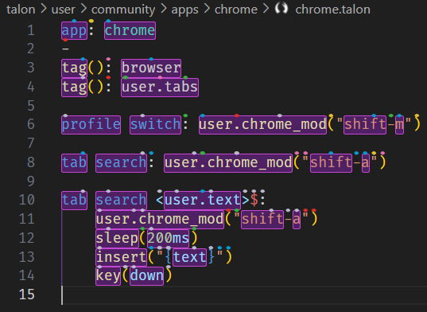

# Customization

Cursorless consists of

- an IDE plugin (eg a VSCode extension), and
- a set of Talon files that define spoken commands

Because of this split, Cursorless has user settings available both on the IDE side, and on the Talon side. The rule of thumb is that anything that changes spoken forms happens Talon-side; everything else is IDE-side.

## IDE-side settings

The IDE settings can be accessed by saying `"cursorless settings"` with your IDE (eg VSCode) focused.

## Talon-side settings

Many of the spoken forms used in cursorless can be easily customized without
needing to fork cursorless or modify the talon / python files contained
therein. If you find that your customization needs cannot be met without making
changes to cursorless files, please [file an
issue](https://github.com/cursorless-dev/cursorless/issues/new) so we can
improve customization.

The spoken forms for actions, scope types, colors, etc can be customized using the
csvs found in the `cursorless-settings` subdirectory of your Talon user folder. On
Linux and Mac, the directory is `~/.talon/user/cursorless-settings`. On
Windows, it is `%AppData%\Talon\user\cursorless-settings`.

The directory location can be customized using the `user.cursorless_settings_directory` Talon setting. If the path is relative, it will be taken relative to your Talon user directory.

Note that these csv's:

- support empty lines,
- support multiple spoken forms for a single identifier using `|` as a separator, eg `ditch|chuck, remove`,
- support comment lines beginning with `#`, and
- ignore leading / trailing whitespace on identifiers and spoken forms

If the spoken form begins with a `-`, it will be disabled. Please do not remove
any lines, because that will trigger cursorless to add them back on next
reload, as cursorless uses these lines to track disabled spoken forms.

### Changing a spoken form

Simply modify the spoken form in the first column of any of the csvs in the
directory above to change the spoken you'd like to use. The new spoken form will be usable immediately.

Multiple spoken forms can be used for the same action using the pipe operator
`remove|delete`

### New features

When new actions, scope types, etc are added, Cursorless will detect that they're missing from your csvs and append the default term to the end. You can then feel free to modify the spoken form if you'd like to change it.

### Removing a term

If you'd like to remove an action, scope type, etc, you can simply set the
spoken form in the first column to any thing starting with `-`. Please don't
delete any lines, as that will trigger cursorless to automatically add the
spoken form back on talon restart.

## \[Experimental\] Cursorless custom IDE actions

You can use Cursorless to run any built-in IDE command on a specific target.

Just add your custom commands to: `experimental/actions_custom.csv`. For example, if you wanted to be able to say `"push down <T>"` to move the line(s) containing target `<T>` downwards, you could do the following:

```csv
Spoken form, VSCode command
push down, editor.action.moveLinesDownAction
```

Now when you say eg "push down air and bat", cursorless will first select the two tokens with a gray hat over the `a` and `b`, then issue the VSCode command `editor.action.moveLinesDownAction`, and then restore your original selection.

## \[Experimental\] Cursorless custom regex scopes

You can define custom scopes using regexes in `user/cursorless-settings/experimental/regex_scope_types.csv`

:::tip

Use `"visualize <scope>"` to see a live preview of the regex scope in [the scope visualizer](./scope-visualizer.md). It updates in real time every time you save `regex_scope_types.csv`.

:::

For example, here's what `"visualize dotted"` would show with the scope type `dotted,"[\w.]+"`:

<div class="light-mode-invert">
  
</div>

You can then use commands such as

- `"take dotted sun"` to select `user.text` (line 10)
- `"copy dotted urge"` to copy `user.chrome_mod` (line 11)
- `"take every dotted urge"` to select `user.chrome_mod`, `shift`, and `a`

:::tip

> Check out [our wiki page](https://github.com/cursorless-dev/cursorless/wiki/Custom-regex-scopes) for a recipe book of user-created regex scopes!

:::

:::warning

Regex matches cannot cross line boundaries (so multiline matches are not supported). The regexes also have the unicode flag set.

:::

## Toggling "hat" display

It is possible to show / hide the hats with a command. Keep in mind that many users, often after less than a week using Cursorless, find that their brain starts to tune out the hat display. Some start to miss them when they're gone 🥲

However, should you like to show / hide the hats within your editor, you can use the following approach.

- Bring up the command pallet(`Shift + CMD + P` on Mac; `Shift + Ctrl + P` on Windows / Linux).
- Enter `cursorless.toggleDecorations` or type `Cursorless Toggle` to see the command in the dropdown.

You should also be able to find the above command by saying `"please toggle"`. The same command can be repeated to turn the hats back on.

While the hats are hidden, you will not be able to address any marks, eg `"take air"`. However, Cursorless will still recognize scopes, eg `"take funk"`.

If you'd like to map a voice command to toggle the hats, have a look at https://youtu.be/oWUJyDgz63k

## Updating word separators

The word separators are characters that defines the boundary between words in a identifier. eg `hello_world` is an identifier with two words separated by `_`. If you like to support other separators like `-` in `hello-world` that can be accomplished by changing the `cursorless.wordSeparators` setting. This setting is also language overridable.

```json
// Sets the word separator for all languages
"cursorless.wordSeparators": ["_"]

// Sets the word separator for css only
"[css]": {
  "cursorless.wordSeparators": ["_", "-"]
}
```

## Cursorless public API

Cursorless exposes a couple talon actions and captures that you can use to define your own custom command grammar leveraging cursorless targets.

### Public Talon captures

- `<user.cursorless_target>`
  Represents a cursorless target, such as `"air"`, `"this"`, `"air past bat"`, `"air and bat"`, `"funk air past token bat and class cap"`, etc

### Public Talon actions

- `user.cursorless_command(action_id: str, target: cursorless_target)`:
  Perform a Cursorless command on the given target
  eg: `user.cursorless_command("setSelection", cursorless_target)`.
  Note that for `"bring"` (`replaceWithTarget`), `cursorless_target` will be the source of the bring and the destination will be the current selection(s), as if you had said `"bring <target>"`
- `user.cursorless_ide_command(command_id: str, target: cursorless_target)`:
  Performs a built-in IDE command on the given target
  eg: `user.cursorless_ide_command("editor.action.addCommentLine", cursorless_target)`
- `user.cursorless_get_text(target: CursorlessTarget, hide_decorations: bool = False) -> str`
  Get text from target. If `hide_decorations` is `true`, will not show decorations.
- `user.cursorless_get_text_list(target: CursorlessTarget, hide_decorations: bool = False) -> list[str]`
  Get texts from multiple targets. If `hide_decorations` is `true`, will not show decorations.
- `user.cursorless_insert(destination: CursorlessDestination, text: Union[str, List[str]])`:
  Insert text at destination.
  eg: `user.cursorless_insert(cursorless_destination, "hello")`
- `user.cursorless_reformat(target: CursorlessTarget, formatters: str)`
  Reformat target with specified formatters.
  eg: `user.cursorless_reformat(cursorless_target, "ALL_CAPS")`

#### Snippet actions

See [snippets](./experimental/snippets.md) for more information about Cursorless snippets.

- `user.cursorless_insert_snippet_by_name(name: str)`: Insert a snippet with the given name, eg `functionDeclaration`
- `user.cursorless_insert_snippet(body: str, destination: Optional[CursorlessDestination], scope_type: Optional[Union[str, list[str]]])`: Insert a snippet with the given body defined using our snippet body syntax (see the [snippet format docs](./experimental/snippet-format.md)). The body should be a single string, which could contain newline `\n` characters, rather than a list of strings as is expected in our snippet json representation. Destination is where the snippet will be inserted. If omitted will default to current selection. An optional scope type can be provided for the target to expand to. `"snip if after air"` for example could be desired to go after the statement containing `air` instead of the token.
- `user.cursorless_wrap_with_snippet_by_name(name: str, variable_name: str, target: CursorlessTarget)`: Wrap the given target with a snippet with the given name, eg `functionDeclaration`. Note that `variable_name` should be one of the variables defined in the named snippet. Eg, if the named snippet has a variable `$foo`, you can pass in `"foo"` for `variable_name`, and `target` will be inserted into the position of `$foo` in the given named snippet.
- `user.cursorless_wrap_with_snippet(body, target, variable_name, scope)`: Wrap the given target with a snippet with the given body defined using our snippet body syntax (see the [snippet format docs](./experimental/snippet-format.md)). The body should be a single string, which could contain newline `\n` characters, rather than a list of strings as is expected in our snippet json representation. Note that `variable_name` should be one of the variables defined in `body`. Eg, if `body` has a variable `$foo`, you can pass in `"foo"` for `variable_name`, and `target` will be inserted into the position of `$foo` in the given named snippet. The `scope` variable can be used to automatically expand the target to the given scope type, eg `"line"`.

### Example of combining capture and action

```talon
add dock string <user.cursorless_target>:
    user.cursorless_command("editNewLineAfter", cursorless_target)
    "\"\"\"\"\"\""
    key(left:3)

push <user.cursorless_target> down:
    user.cursorless_ide_command("editor.action.moveLinesDownAction", cursorless_target)
```

### Example of custom formatter command

The below command will allow you to say `camel form blue air`.  
_You can disable the default Cursorless reformat command by prefixing the spoken form in `actions.csv` with a dash. `-format, applyFormatter`_

```talon
<user.formatters> form <user.cursorless_target>:
    user.cursorless_reformat(cursorless_target, formatters)
```

### Disable legacy destination grammar

The grammar currently supports `paste to before air`. This grammar is considered deprecated/legacy and replaced by `paste before air`. You can today disable this legacy grammar by enabling the tag `user.cursorless_disable_legacy_destination`
