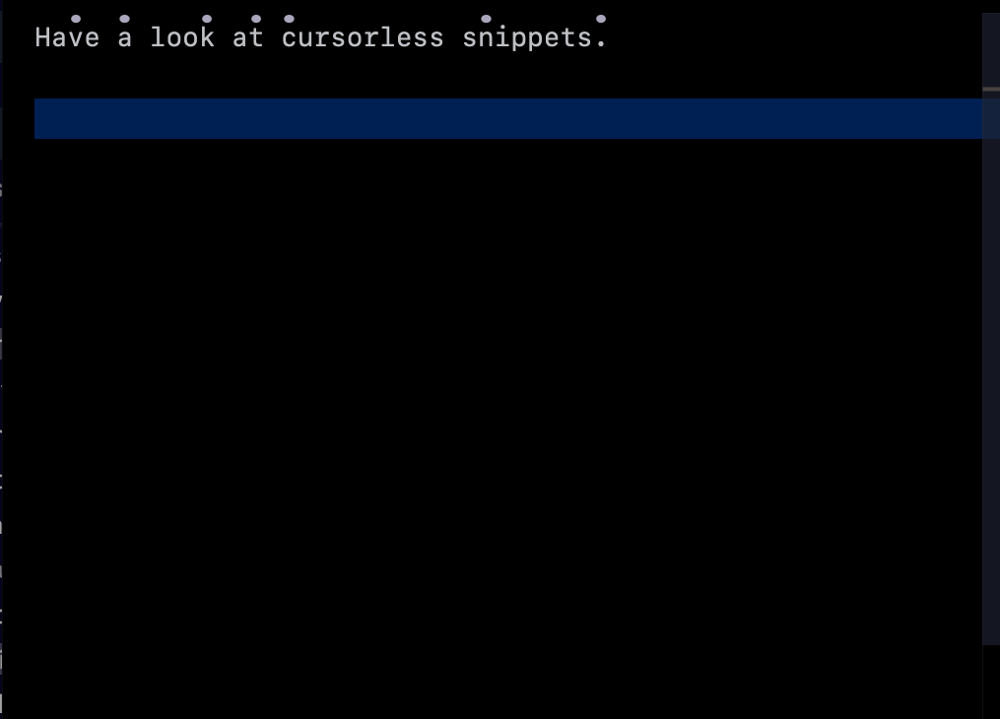

# Snippets




Cursorless has its own experimental snippet engine that allows you to both insert snippets and wrap targets with snippets. Cursorless ships with a few built-in snippets, but users can also use their own snippets.

## Using snippets

### Wrapping a target with snippets

#### Command syntax

The command syntax is as follows:

```
"<snippet_name> wrap <target>"
```

#### Examples

- `"try wrap air"`: Wrap the statement containing the marked `a` in a try-catch statement
- `"try wrap air past bat"`: Wrap the sequence of statements from the marked `a` to the marked `b` in a try-catch statement

#### Default scope types

Each snippet wrapper has a default scope type. When you refer to a target, by default it will expand to the given scope type. This way, for example, when you say `"try wrap air"`, it will refer to the statement containing `a` rather than just the token.

### Built-in wrapper snippets

| Default spoken form | Snippet                                       | Default target scope type |
| ------------------- | --------------------------------------------- | ------------------------- |
| `"if wrap"`         | If statement                                  | Statement                 |
| `"else wrap"`       | If-else statement; target goes in else branch | Statement                 |
| `"if else wrap"`    | If-else statement; target goes in if branch   | Statement                 |
| `"try wrap"`        | Try-catch statement                           | Statement                 |
| `"link wrap"`       | Markdown link                                 |                           |
| `"funk wrap"`       | Function                                      | Statement                 |

### Inserting a snippet

The same snippet definitions that allow for wrapping targets can also be used for insertion. You can either insert a snippet at the current cursor position, or use a positional target to insert before / after / replace something.

#### Command syntax

The command syntax options are as follows. In its simplest form, you can just say

```
"snippet <snippet_name>"
```

This command will insert a snippet at the current position. For example:

- `"snippet funk"`
- `"snippet if"`

For some snippets, you can include a phrase, that will automatically fill a particular snippet variable with the given phrase, formatted properly:

```
"snippet <snippet_name> <phrase>"
```

For example:

- `"snippet funk hello world"`: Insert function with name `helloWorld`

Finally, we support inserting a snippet onto, before or after a Cursorless target:

```
"snippet <snippet_name> before <target>"
"snippet <snippet_name> after <target>"
"snippet <snippet_name> to <target>"
```

For example:

- `"snippet if after air"`: Insert `if` statement after the statement with a hat over the `a`

Note that each snippet can use `insertionScopeTypes` to indicate that it will auto-expand the target. So, for example, `"snippet if after this"` will insert an `if` statement after the current statement.

### Built-in insertion snippets

| Default spoken form | Snippet                                 | Default insertion scope type | Accepts optional phrase? |
| ------------------- | --------------------------------------- | ---------------------------- | ------------------------ |
| `"snippet if"`      | If statement                            | Statement                    | ❌                       |
| `"snippet if else"` | If-else statement                       | Statement                    | ❌                       |
| `"snippet try"`     | Try-catch statement                     | Statement                    | ❌                       |
| `"snippet funk"`    | Function; phrase becomes name           | Function                     | ✅                       |
| `"snippet link"`    | Markdown link; phrase becomes link text |                              | ✅                       |

## Customizing spoken forms

As usual, the spoken forms for these snippets can be [customized by csv](../customization.md). The csvs are in the files in `cursorless-settings/experimental` with `snippet` in their name.

In addition, you can change the term `"snippet"` (for snippet insertion) using actions.csv. Keep in mind that if you change it to `"snip"`, you may want to turn off the built-in knausj `"snip"` commands to avoid conflicts.

## Adding your own snippets

To define your own snippets, proceed as follows:

### Define snippets in vscode

1. In your VSCode Cursorless settings (say `"cursorless settings"`), set the `cursorless.experimental.snippetsDir` setting to a directory in which you'd like to create your snippets.
2. Add snippets to the directory in files ending in `.cursorless-snippets`. See the [documentation](snippet-format.md) for the cursorless snippet format.

### 2. Add snippet to spoken forms csvs

Snippets can be used for wrapping or insertion or both.

#### For wrapping

For each snippet that you'd like to be able to use as a wrapper snippet, add a line to the `cursorless-settings/experimental/wrapper_snippets.csv` csv overrides file. The first column is the desired spoken form, and the second column is of the form `<name>.<variable>`, where `name` is the name of the snippet (ie the key in your snippet json file), and `variable` is one of the placeholder variables in your snippet where the target should go.

#### For insertion

For each snippet that you'd like to be able to use for insertion, add a line to one of the following files:

- Use `cursorless-settings/experimental/insertion_snippets.csv` if you **don't** need an optional trailing phrase (eg for `"snippet funk hello world"` to provide a function name). In this case, the first column is the spoken form, and the second column is the snippet name.
- Use `cursorless-settings/experimental/insertion_snippets_single_phrase.csv` if you want to be able to include an optional extra phrase. In this csv, the first column is the desired spoken form, and the second column is of the form `<name>.<variable>`, where `name` is the name of the snippet (ie the key in your snippet json file), and `variable` is one of the placeholder variables in your snippet where the extra phrase should go.

## Customizing built-in snippets

To customize a built-in snippet, just define a custom snippet (as above), but
use the same name as the cursorless core snippet you'd like to change, and give
definitions along with scopes where you'd like your override to be active. Here
is an example:

```json
{
  "tryCatchStatement": {
    "definitions": [
      {
        "scope": {
          "langIds": [
            "typescript",
            "typescriptreact",
            "javascript",
            "javascriptreact"
          ]
        },
        "body": ["try {", "\t$body", "} catch (err) {", "\t$exceptBody", "}"]
      }
    ]
  }
}
```

The above will change the definition of the try-catch statement in typescript.
