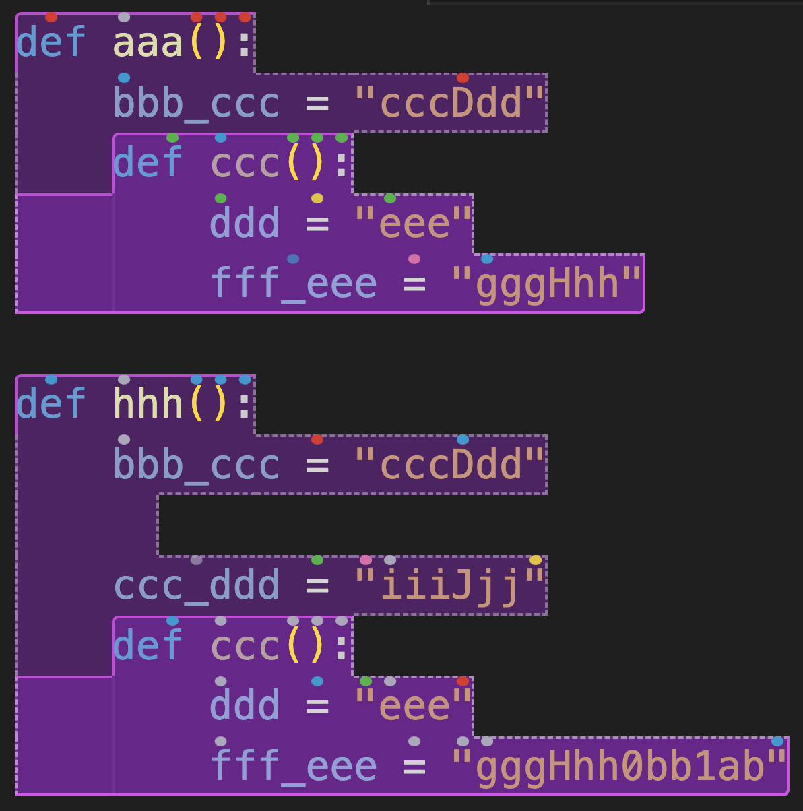
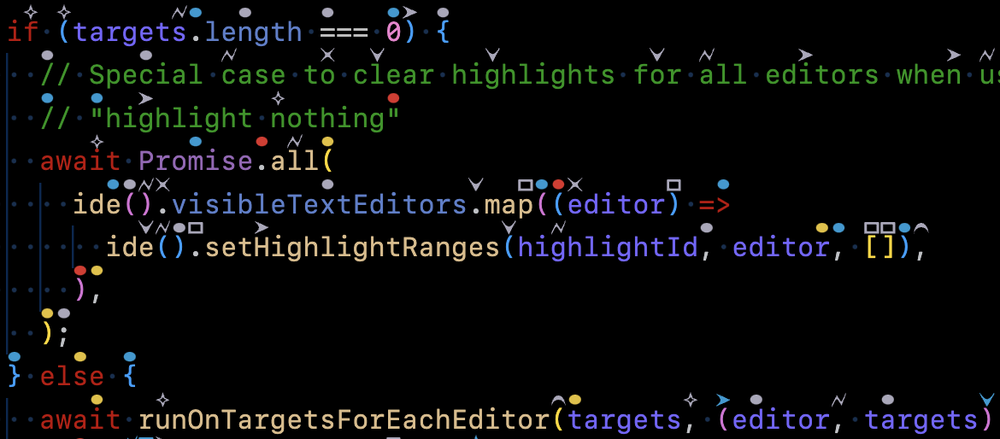
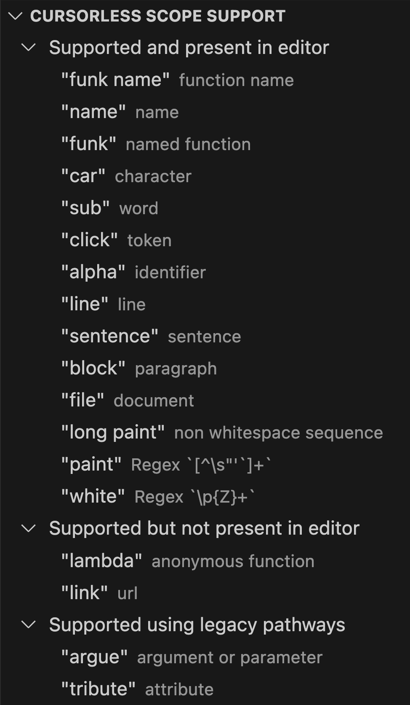

# Release Notes for 0.27.0

## Preamble

We've realized that the biggest (only?) drawback of continuous delivery is a deficit of 🙌🎉🎸 around releases. So we're going to start writing "release notes" to point out things you already have, but might not have noticed. And then hopefully you'll realise how busy we've been and [sponsor the project](https://github.com/sponsors/pokey) if you can afford it so we can keep Cursorless free for everyone while still shipping truckloads of 🙌 😇.

Given we don't actually have "releases", we're arbitrarily considering everything merged since the start of 2023 to be part of this "release", as we last wrote a big announcement message at the start of the year summarizing [our work in 2022](./2022-year-in-review.md). Expect the next "release" to be sooner than that.

## The subject at hand

Since the start of 2023, we've merged [289 PRs from 9 authors](https://github.com/cursorless-dev/cursorless/pulls?q=is%3Apr+is%3Amerged+merged%3A%3E%3D2023-01-01+sort%3Aupdated-asc) (including a whopping [59](https://github.com/cursorless-dev/cursorless/pulls?q=is%3Apr+is%3Amerged+merged%3A%3E%3D2023-01-01+sort%3Aupdated-asc+author%3AAndreasArvidsson) from [@AndreasArvidsson](https://github.com/sponsors/AndreasArvidsson)!), so there's a lot of ground to cover 😅

But here are some highlights:

## 🚀 Features

- Added full scope support for the Talon language ([#1555](https://github.com/cursorless-dev/cursorless/pull/1555)), so you can `"change name"`, `"clone command"`, `"clear inside command"`, and `"copy condition"` in `.talon` files to your heart's content. Note that Talon is our first language implemented entirely using next-gen scopes, so the [scope visualizer](../scope-visualizer.md), next-gen inference engine, and other next-gen features work great here (see below for more on what all that means).
- New scopes!
  - `"branch"` ([#1149](https://github.com/cursorless-dev/cursorless/pull/1149))
  - `"instance"` ([video 🎬](https://youtu.be/rqWmwcfZ_sw)) ([#1497](https://github.com/cursorless-dev/cursorless/pull/1497))
  - `"sentence"` ([video 🎬](https://youtu.be/rdLH2GKJirE)) ([#1595](https://github.com/cursorless-dev/cursorless/pull/1595))
- Added [the scope visualizer](../scope-visualizer.md) ([#1653](https://github.com/cursorless-dev/cursorless/pull/1653)) to let you visualize scopes live in your editor. Video to follow; stay tuned 😎. But here's a screenshot 
- A next-gen inference engine that enables a much more powerful grammar, allowing you to do things like individually targeting a sequence of scopes, eg `"every line air past bat"`. To learn more, see the initial [#1462](https://github.com/cursorless-dev/cursorless/pull/1462), and then the follow-up [#1463](https://github.com/cursorless-dev/cursorless/pull/1463) if you're addicted to 🤯. Note that this grammar only works for our next-gen scopes, which include most generic scopes (`"line"`, `"token"`, `"word"`, `"character"`, `"block"`), as well as some language-specific scopes. We still have a lot of language-specific scopes to upgrade, as the infrastructure to do so is still quite new. Stay tuned
- [Stable hats](../hatAssignment.md) ([#1252](https://github.com/cursorless-dev/cursorless/pull/1252)) keep hats from moving around so much while you edit. This change is something you may or may not have consciously noticed, but if you spontaneously experienced a deep feeling of oneness and calm at some point in the past six months, the newly meditative hats might have been the cause 🎩🧘
- Improved support for very large hats. A trend among users has been to slightly increase their line height (eg 1.6) and then use a very large hat size (eg 70) to make the hats more visible. This works great, but adjacent hats would overlap. Now, we automatically detect clashing hats and stop them from growing horizontally if they'd overlap ([#1687](https://github.com/cursorless-dev/cursorless/pull/1687)). @pokey is now running with a line height of 1.6 and a hat size of 70, after getting serious hat-size envy during some user screenshares on discord 👒. If you want to join the big hat revolution, say `"show settings phrase line height"` to mess with your line height, then `"cursorless settings"` to mess with your hat size
- Lots of improvements to our Go language support (thanks [@josharian](https://github.com/josharian)!)
- Expanded our [Talon-side custom API](../customization.md#public-talon-actions) to
  - allow [snippet wrapping / insertion](../customization.md#snippet-actions) ([#1329](https://github.com/cursorless-dev/cursorless/pull/1329)), used eg for [Cursorless mathfly 🎬](https://youtu.be/v0j2_W97_s0), and
  - include actions such as `"bring"` ([#1226](https://github.com/cursorless-dev/cursorless/pull/1226)).
- `"snippet funk"` now behaves differently if you're in a class vs at module level ([#1487](https://github.com/cursorless-dev/cursorless/pull/1487)). This feature is almost certainly not worth calling out in the release notes, but @pokey was really excited about it, so let's not spoil his fun. More broadly, this feature enables you to have different snippets inserted depending whether you're in a particular Cursorless scope.

## 🐛 Bug fixes

We fixed [dozens of bugs](https://github.com/cursorless-dev/cursorless/issues?q=is%3Aissue+is%3Aclosed+closed%3A%3E%3D2023-01-01+reason%3Acompleted+sort%3Aupdated-asc+label%3Abug); probably easiest to look at the list.

## 📜 Documentation

- Added a version of the cheatsheet hosted [on our website](https://www.cursorless.org/cheatsheet) so you can show your friends how cool Cursorless is without having to send them a PDF. Note that this version uses the default spoken forms, rather than the ones you've customized.
- [@josharian](https://www.youtube.com/@josharian) has made a fantastic series of YouTube videos called [Cursorless by example](https://www.youtube.com/watch?v=2hPwfBCtXws&list=PLbN8ceamGu2c6JrNf83EWyP6K5K77MzVZ). Even Cursorless pros will learn something!
- [Lots of other docs improvements](https://github.com/cursorless-dev/cursorless/pulls?q=is%3Apr+is%3Amerged+merged%3A%3E%3D2023-01-01+sort%3Aupdated-asc+label%3Adocumentation+)

## 🤓 Internal improvements

In addition all the features we've shipped this year, we have made significant improvements to our core infrastructure.

Here are some highlights:

- Abstracted away all references to VSCode's apis, which will enable us to launch Cursorless in other IDEs, such as JetBrains, emacs, etc, as well as integrate with [Rango](https://github.com/david-tejada/rango/), and even work globally using OCR / accessibility APIs to place hats anywhere on the screen. Stay tuned
- Added tests for our spoken forms ([#1637](https://github.com/cursorless-dev/cursorless/pull/1637)), which means we now have full end-to-end coverage all the way from spoken form to action to editor state for 2,757 different commands (and counting!), so you can be sure if a command works today, it will work tomorrow
- Switched to a pnpm monorepo ([#1281](https://github.com/cursorless-dev/cursorless/pull/1281)) to allow us to share code / source of truth between Cursorless VSCode, Cursorless for other IDEs, Cursorless on the web, Cursorless docs, etc. See [the video 🎬](https://youtu.be/Od7BZHc7w6c) to learn more. Who knows, you might even switch your project to a pnpm monorepo after watching
- Switch to [pure DI](https://blog.ploeh.dk/2014/06/10/pure-di/) to make it easier to test and reason about our code, and to make it easier to support other IDEs
- Built a new way to represent our language-specific (tree-sitter) scopes that makes them vastly more powerful, enabling features like the scope visualizer, next-gen grammar, etc ([#629](https://github.com/cursorless-dev/cursorless/pull/629))
- Crystallized our notion of "destinations", a concept that unifes "bring air **to bat**", "paste **after funk drum**", "snip funk **before this**", "**pour line**", and "**drink item**" ([#1605](https://github.com/cursorless-dev/cursorless/pull/1605)). This change will enable functionality like `"bring type air to bat"` when `bat` doesn't yet have a type ([#1631](https://github.com/cursorless-dev/cursorless/issues/1631)), and many other improvements. We'll be updating the docs to reflect this new understanding shortly.
- Built a utility that can automatically generate the spoken form that was used to issue a command ([#1671](https://github.com/cursorless-dev/cursorless/pull/1671)). This function will enable us to automatically customize the docs using your personal spoken forms, as well as allow you to see what spoken form you would use to issue a command from one of [@pokey's videos 🎬](https://www.youtube.com/@PokeyRuleJams), and allow us to create interactive tutorials running in VSCode that will use your custom spoken forms.

## 📈 What's next?

### Short term

Tough to pick favorites, but here are three highlights from our [short-term roadmap](https://github.com/cursorless-dev/cursorless/milestone/10):

- A VSCode sidebar that shows you which scopes are present in your current file, updated in real-time. Combined with the [scope visualizer](../scope-visualizer.md), we hope this will be an antidote to the Cursorless cheatsheet's "what on Earth are all these scopes and are any of them relevant to me?" problem. Here's a sneak preview (🤫):  In case you don't recognize some of those scope types, that's because it will show your [custom spoken forms](../customization.md), and mine are probably different from yours!
- Migrate all scopes for every language to next-gen scopes, enabling next-gen inference (eg `"every funk air past bat"`), scope visualizer, tree view, etc. This is an area where we would love contributions from our more adventurous users. We've built some powerful tooling here so the DX is 🔥; you're going to have a blast if you're into hot-reloading, beautifully rendered syntax trees. Come find us on Slack and Discord if you're interested
- A major docs restructure to make it easier to find what you're looking for and understand how it all fits together. The new docs will include many more examples, including examples automatically generated from our test cases, which includes basically everything you can possibly do with Cursorless (did we mention we have >2.5k full end-to-end tests? Not like we're bragging or anything 🙄 💅)

### Medium term

Here are a few highlights from our [medium-term roadmap](https://github.com/cursorless-dev/cursorless/milestone/8):

- Cursorless on vscode.dev / other VSCode web clients ([#1023](https://github.com/cursorless-dev/cursorless/issues/1023))
- Interactive tutorials running in VSCode ([#934](https://github.com/cursorless-dev/cursorless/issues/934))
- Cursorless for other IDEs, such as JetBrains, emacs, etc
- A vastly expanded Talon-side API to enable much more powerful custom grammars ([#494](https://github.com/cursorless-dev/cursorless/issues/494))
- Bookmarking targets to allow more complex commands, even across multiple files ([#46](https://github.com/cursorless-dev/cursorless/issues/46))
- Changes that will enable more fluent chaining, such as modifying the target of a bring in a single phrase ([#414](https://github.com/cursorless-dev/cursorless/issues/414))
- More videos ([#506](https://github.com/cursorless-dev/cursorless/discussions/506))
- And so much more!

We'd like to end with a massive thank you to [our sponsors 🎉](https://github.com/sponsors/pokey), without whom Cursorless development would not be possible!
