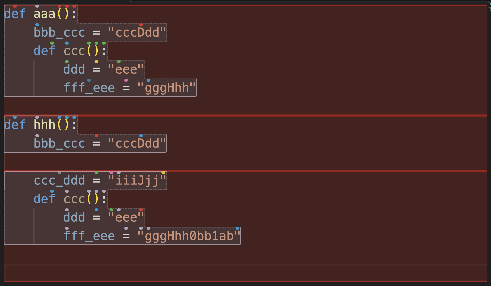

# Scope visualizer

The scope visualizer allows you to visualize Cursorless scopes on your code in real time. It is useful to understand how Cursorless scopes work, and is also useful for Cursorless contributors as they develop new scopes. You may find the [scope visualizer intro video](https://youtu.be/BbXEzUrf5lU) helpful.

## Usage

To start the scope visualizer, say `"visualize <scope>"`, where `<scope>` is the name of the scope you want to visualize. For example, `"visualize funk"`. To stop the scope visualizer, say `"visualize nothing"`.

You can also visualize removal and iteration ranges for scopes by saying `"visualize <scope> removal"` and `"visualize <scope> iteration"`, respectively.

## Examples

### `"visualize funk"`

### `"visualize token"`

### `"visualize block removal"`

