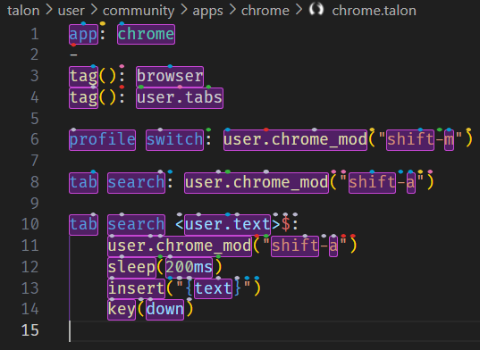

# Custom regex scopes

You can define custom scopes using regexes in `user/cursorless-settings/experimental/regex_scope_types.csv`

:::tip

Use `"visualize <scope>"` to see a live preview of the regex scope in [the scope visualizer](./scope-visualizer.md). It updates in real time every time you save `regex_scope_types.csv`.

:::

For example, here's what `"visualize dotted"` would show with the scope type `dotted,"[\w.]+"`:

  

You can then use commands such as

- `"take dotted sun"` to select `user.text` (line 10)
- `"copy dotted urge"` to copy `user.chrome_mod` (line 11)
- `"take every dotted urge"` to select `user.chrome_mod`, `shift`, and `a`

## Examples

| Spoken form  | Regex                                                                    | Notes                                                                                       | Example                      |
| ------------ | ------------------------------------------------------------------------ | ------------------------------------------------------------------------------------------- | ---------------------------- |
| dotted       | `"[\w.]+"`                                                               | Matches dotted expression                                                                   | `one.two.three`              |
| pair math    | `"\$[^$]*\$"`                                                            | Matches latex inlined math expression. May fail to match if line has unmatched expressions. | `$e^{\pi i}=-1$`             |
| inside math  | `"[^$]*"`                                                                | Matches interior of a latex inlined math expression                                         | `e^{\pi i}=-1`               |
| chain pipe   | `(?:%>%\|%<>%\|%T>%\|\|>)`                                               | Matches R pipe operators                                                                    | `%>%`, `%<>%`, `%T>%`, `\|>` |
| inside chain | `(?<=(?:%>%\|%<>%\|%T>%\|\|>)\s*)\S.*?\S(?=\s*(?:%>%\|%<>%\|%T>%\|\|>))` | Matches content between pipe operators in R chains                                          | `filter(x > 0)`              |
| head chain   | `(?<=(?:%>%\|%<>%\|%T>%\|\|>)\s*)\S[^\|%\n]*`                            | Matches content from current position until next pipe operator                              | `mutate(y = x * 2) %>%`      |
| tail chain   | `\S.*?\S?(?=\s*(?:%>%\|%<>%\|%T>%\|\|>))`                                | Matches content from pipe until current position                                            | ` %>% filter(x > 0)`         |

:::warning

Regex matches cannot cross line boundaries (so multiline matches are not supported). The regexes also have the unicode flag set.

:::
