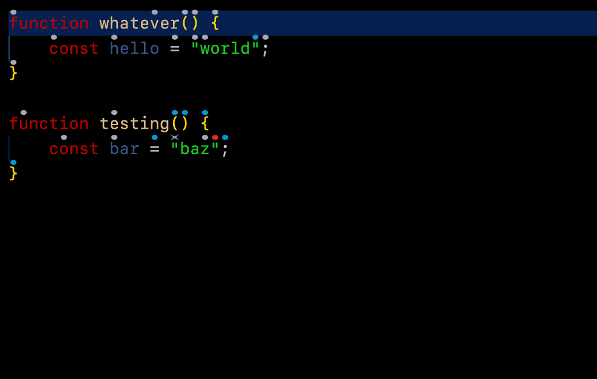
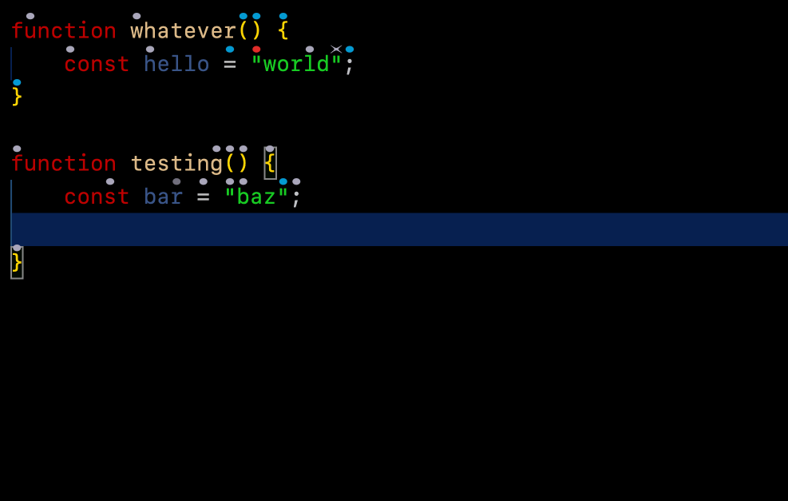
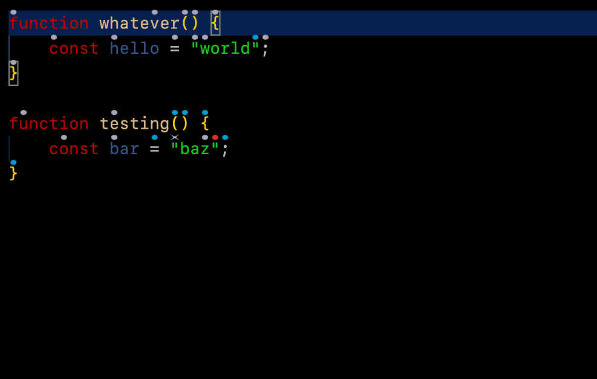

# Modal keyboard interface

Cursorless has an experimental modal keyboard interface. This allows you to switch to Cursorless mode, and then you can use your keyboard to control Cursorless without holding any modifier keys, similar to how `vim` works.

The Cursorless keyboard interface works by moving a highlight around, and allowing you to perform actions on the highlighted target.





## Using modal mode

Keyboard commands are built incrementally around the highlighted target. First target a mark, then apply any scopes or modifiers, and finally perform an action. This is the reverse of the spoken command order because each keyboard command updates the highlight for the next command.

With the example keybindings below:

| Keys                | Result                                       | Spoken equivalent |
| ------------------- | -------------------------------------------- | ----------------- |
| `d`, `a`            | Target the default hat over `a`              | `"air"`           |
| `g`, `a`            | Target the green hat over `a`                | `"green air"`     |
| `d`, `a`, `sf`      | Expand the target to its containing function | `"funk air"`      |
| `d`, `a`, `sf`, `t` | Select the containing function               | `"take funk air"` |
| `sf`, `t`           | Select the function containing the cursor    | `"take funk"`     |

The keys used for actions, targets, and modifiers are context-sensitive. For example, after you press `d` for the default color, Cursorless waits for the character beneath the hat. Multi-key mappings such as `sf` are supported, but a pause does not complete a partial key sequence.

## Set up / config

### `keybindings.json`

Paste the following into your [VS Code `keybindings.json`](https://code.visualstudio.com/docs/getstarted/keybindings#_advanced-customization):

```json
    {
        "key": "ctrl+c",
        "command": "cursorless.keyboard.modal.modeOn",
        "when": "editorTextFocus"
    },
    {
        "key": "ctrl+c",
        "command": "cursorless.keyboard.targeted.targetSelection",
        "when": "cursorless.keyboard.modal.mode && editorTextFocus"
    },
    {
        "key": "escape",
        "command": "cursorless.keyboard.escape",
        "when": "cursorless.keyboard.listening && editorTextFocus && !suggestWidgetMultipleSuggestions && !suggestWidgetVisible"
    }
```

Any keybindings that use modifier keys should go in `keybindings.json` as well, with a `"when": "cursorless.keyboard.modal.mode"` clause.

For example, these bindings use modifier keys to target a default or green hat. After pressing either shortcut, press the character beneath the hat:

```json
    {
        "key": "ctrl+t",
        "command": "cursorless.keyboard.targeted.targetHat",
        "args": { "color": "default" },
        "when": "cursorless.keyboard.modal.mode && editorTextFocus"
    },
    {
        "key": "ctrl+shift+t",
        "command": "cursorless.keyboard.targeted.targetHat",
        "args": { "color": "green" },
        "when": "cursorless.keyboard.modal.mode && editorTextFocus"
    }
```

The above allows you to press `ctrl-c` to switch to Cursorless mode and `escape` to exit Cursorless mode.

If you're already in Cursorless mode, pressing `ctrl-c` again will target the current selection, which is useful if you have moved the cursor using your mouse while in Cursorless mode, and want to target your new cursor position.

### `settings.json`

To bind keys that do not have modifiers (eg just pressing `a`), add entries like the following to your [VS Code `settings.json`](https://code.visualstudio.com/docs/getstarted/settings#_settingsjson) (or edit these settings in the VS Code settings gui by saying `"cursorless settings"`):

```json
  "cursorless.experimental.keyboard.modal.keybindings.scope": {
    "i": "line",
    "p": "paragraph",
    ";": "statement",
    ",": "collectionItem",
    ".": "functionCall",
    "'": "string",
    "sf": "namedFunction",
    "sc": "class",
    "st": "token",
    "sy": "type",
    "sv": "value",
    "sk": "collectionKey",
    "sp": "nonWhitespaceSequence",
    "ss": "boundedNonWhitespaceSequence",
    "sa": "argumentOrParameter",
    "sl": "url",
  },
  "cursorless.experimental.keyboard.modal.keybindings.action": {
    "t": "setSelection",
    "h": "setSelectionBefore",
    "l": "setSelectionAfter",
    "O": "editNewLineBefore",
    "o": "editNewLineAfter",
    "k": "insertCopyBefore",
    "j": "insertCopyAfter",
    "u": "replaceWithTarget",
    "m": "moveToTarget",
    "c": "clearAndSetSelection",
    "as": "swapTargets",
    "af": "foldRegion",
    "ak": "insertEmptyLineBefore",
    "aj": "insertEmptyLineAfter",
    "ai": "insertEmptyLinesAround",
    "ac": "copyToClipboard",
    "ax": "cutToClipboard",
    "ap": "pasteFromClipboard",
    "ad": "followLink",
    "aw": "remove",
  },
  "cursorless.experimental.keyboard.modal.keybindings.color": {
    "d": "default",
    "b": "blue",
    "g": "green",
    "r": "red"
  },
  "cursorless.experimental.keyboard.modal.keybindings.shape": {
    "x": "ex",
    "f": "fox",
    "q": "frame",
    "v": "curve",
    "e": "eye",
    "y": "play",
    "z": "bolt",
    "w": "crosshairs"
  },
  "cursorless.experimental.keyboard.modal.keybindings.vscodeCommand": {
    // For simple commands, just use the command name
    // "aa": "workbench.action.editor.changeLanguageMode",

    // For commands with args, use the following format
    // "am": {
    //   "commandId": "some.command.id",
    //   "args": ["foo", 0]
    // }

    // If you'd like to run the command on the active target, use the following format
    "am": {
      "commandId": "editor.action.joinLines",
      "executeAtTarget": true,
      // "keepChangedSelection": true,
      // "exitCursorlessMode": true,
    }
  }
```

Any supported scopes, actions, or colors can be added to these sections, using the same identifiers that appear in the second column of your customisation csvs. Feel free to add / tweak / remove the keyboard shortcuts above as you see fit.

The above allows you to press `d` followed by any letter to highlight the given token, `i` to expand to its containing line, and `t` to select the given target.

Key sequences are supported, for example mapping `af` to the fold action. One mapping cannot be a prefix of another; Cursorless reports those mappings as conflicting.
