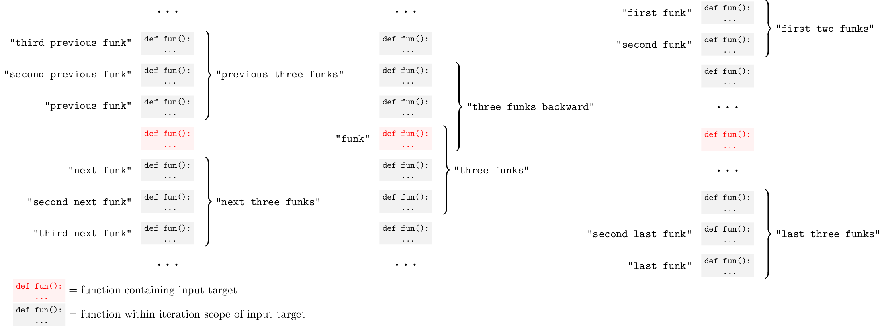

# Ordinal scope

The iteration scope depends on the scope type. For example, functions iterate within a class, tokens within a line, and characters within a token.

Without `"every"`, plural ordinal forms produce one contiguous range. Prefix them with `"every"` to produce separate targets instead.

Cursorless ID: `ordinalScope`

## Syntax

- `<ordinal>` `<scope>` - `<ordinal>` instance of `<scope>` in iteration scope.
- `<ordinal>` last `<scope>` - `<ordinal>`-to-last instance of `<scope>` in iteration scope.
- first `<number>` `<scope>`s - First `<number>` instances of `<scope>` in iteration scope, as contiguous range.
- every first `<number>` `<scope>`s - First `<number>` instances of `<scope>` in iteration scope, as individual targets.
- last `<number>` `<scope>`s - Last `<number>` instances of `<scope>` in iteration scope, as contiguous range.
- every last `<number>` `<scope>`s - Last `<number>` instances of `<scope>` in iteration scope, as individual targets.

## Examples

- `"take third state"` - Selects the third statement in the iteration scope.
- `"take third last state"` - Selects the third-to-last statement in the iteration scope.
- `"take first three states"` - Selects a contiguous range containing the first three statements in the iteration scope.
- `"take every first three states"` - Selects the first three statements in the iteration scope as individual targets.
- `"take last three states"` - Selects a contiguous range containing the last three statements in the iteration scope.
- `"take every last three states"` - Selects the last three statements in the iteration scope as individual targets.
