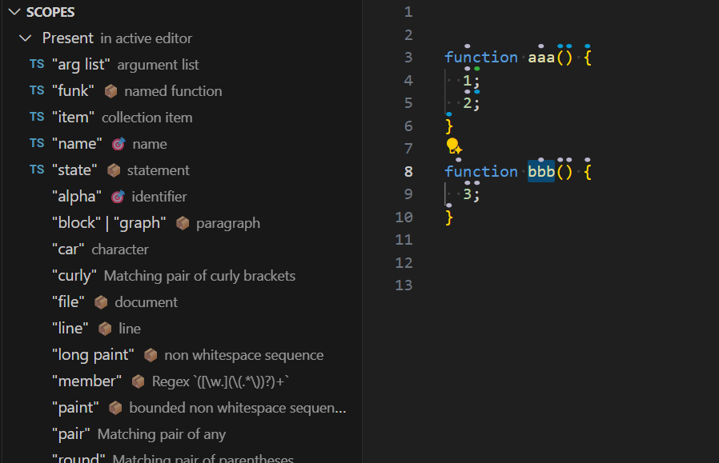

# Cursorless sidebar

You can say `"bar cursorless"` to show the Cursorless sidebar.

## Scopes

- Displays all available scopes, grouped by whether they are currently present and supported in the active text editor.
- The list updates in real time as you type or move your selection.
- Clicking a scope highlights it using the [scope visualizer](scope-visualizer.md).
- Shows your custom spoken forms for scopes.

### Scope icons

To identify the scope for a piece of code:

1. First select the code in your editor.
2. Then look in the sidebar for the following icons:\
   🎯 The scope exactly matches your selection\
   📦 The scope contains your selection

## Tutorial

The sidebar includes interactive tutorials that teach Cursorless using guided exercises in a practice document:

- **Introduction** covers selecting tokens and ranges, using multiple targets, working with lines, deleting text, and positioning the cursor.
- **Basic coding** covers structural scopes and actions such as clone, swap, pour, bring, and dedent.

Each step shows a command to say and usually advances automatically when you complete it. The tutorial uses your custom spoken forms and saves your progress so that you can continue where you left off.

### Start a tutorial

With VSCode focused, say `"cursorless tutorial"` to start or continue the Introduction tutorial.

To choose a tutorial, say `"tutorial list"`, then click its name or say `"tutorial <number>"`. For example, say `"tutorial two"` to start or continue Basic coding.

You can also say `"bar cursorless"` and choose a tutorial from the Tutorial section of the sidebar.

### Navigate the tutorial

You can use the arrow buttons in the sidebar or these commands:

- `"tutorial next"` - Move to the next step.
- `"tutorial previous"` or `"tutorial last"` - Move to the previous step.
- `"tutorial restart"` - Return to the first step of the current tutorial.
- `"tutorial list"` or `"tutorial close"` - Return to the tutorial list.

The tutorial opens a practice document and expects it to match the current exercise. If you edit the document or move away from it, say `"tutorial resume"` to restore the current step and continue.
