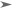
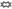

# Targets

There are two types of targets: primitive targets and compound targets. Compound targets are constructed from primitive targets, so let's begin with primitive targets.

## Primitive targets

A primitive target consists of a mark and one or more optional modifiers. The simplest primitive targets consist only of a mark, so let's begin with those.

### Marks

There are several types of marks:

#### Decorated symbol

This is the first type of mark you'll notice when you start using cursorless. You'll see that for every token on the screen, one of its characters will have a hat on top of it. We can refer to the given token by saying the name of the character that has a hat, along with the color if the hat is not gray, and the shape of the hat if the hat is not the default dot:

- `"air"` (if the color is gray)
- `"blue bat"`
- `"blue dash"`
- `"blue five"`
- `"fox bat"`
- `"blue fox bat"`

The general form of this type of mark is:

`"[<color>] [<shape>] (<letter> | <symbol> | <number>)"`

Combining this with an action, we might say `"take blue air"` to select the token containing letter `'a'` with a blue hat over it.

##### Colors

The following colors are supported. Note that to target the default (gray) hat you don't need to specify a color.

| Spoken form      | Color   | Internal ID  | Enabled by default? |
| ---------------- | ------- | ------------ | ------------------- |
| N/A              | grey    | `default`    | ✅                  |
| `"blue"`         | blue    | `blue`       | ✅                  |
| `"green"`        | green   | `green`      | ✅                  |
| `"red"`          | red     | `red`        | ✅                  |
| `"pink"`         | pink    | `pink`       | ✅                  |
| `"yellow"`       | yellow  | `yellow`     | ✅                  |
| `"navy"`         | navy    | `userColor1` | ❌                  |
| `"apricot"`      | apricot | `userColor2` | ❌                  |
| `"user color 3"` | user 3  | `userColor3` | ❌                  |
| `"user color 4"` | user 4  | `userColor4` | ❌                  |

You can enable or disable colors in your VS Code settings, by searching for [`cursorless.hatEnablement.colors`](vscode://settings/cursorless.hatEnablement.colors) and checking the box next to the internal ID for the given shape as listed above. To navigate to your VS Code settings, either say "show settings", or go to File --> Preferences --> Settings.

You can also tweak the visible colors for any of these colors in your VS Code settings, by searching for [`cursorless.colors`](vscode://settings/cursorless.colors) and changing the hex color code next to the internal ID for the given shape as listed above. Note that you can configure different colors for dark and light themes. See our [visual accessibility guide](./visual-accessibility.md) for more on visual accessibility.

If you find these color names unintuitive / tough to remember, their
spoken forms can be [customized](./customization.md) like any other spoken form
in Cursorless. If you change a spoken form to be more than one syllable, you
can change the penalty in the [`cursorless.hatPenalties.colors`](vscode://settings/cursorless.hatPenalties.colors) setting to the
number of syllables you use, so that Cursorless can optimize hat allocation to
minimize syllables.

##### Shapes

The following shapes are supported. Note that to target the default (dot) shape you don't need to specify a shape.

| Spoken form | Shape                                                              | Internal ID  | Enabled by default? |
| ----------- | ------------------------------------------------------------------ | ------------ | ------------------- |
| N/A         |        | `default`    | ✅                  |
| `"bolt"`    |              | `bolt`       | ❌                  |
| `"curve"`   |            | `curve`      | ❌                  |
| `"fox"`     |                | `fox`        | ❌                  |
| `"frame"`   |            | `frame`      | ❌                  |
| `"play"`    |              | `play`       | ❌                  |
| `"wing"`    |              | `wing`       | ❌                  |
| `"hole"`    |              | `hole`       | ❌                  |
| `"ex"`      |                  | `ex`         | ❌                  |
| `"cross"`   |  | `crosshairs` | ❌                  |
| `"eye"`     |                | `eye`        | ❌                  |

You can enable or disable shapes in your VS Code settings, by searching for [`cursorless.hatEnablement.shapes`](vscode://settings/cursorless.hatEnablement.shapes) and checking the box next to the internal ID for the given shape as listed above. To navigate to your VS Code settings, either say "show settings", or go to File --> Preferences --> Settings.

If you find these shape names unintuitive / tough to remember, their
spoken forms can be [customized](./customization.md) like any other spoken form
in cursorless. If you change a spoken form to be more than one syllable, you
can change the penalty in the [`cursorless.hatPenalties.shapes`](vscode://settings/cursorless.hatPenalties.shapes) setting to the
number of syllables you use, so that cursorless can optimize hat allocation to
minimize syllables.

#### `"this"`

The word `"this"` can be used as a mark to refer to the current cursor(s) or selection(s) as a target. Note that when combined with a modifier, the `"this"` mark can be omitted, and it will be implied.

- `"chuck this"`
- `"take funk this"`
- `"pre funk"`
- `"chuck line"`

Note that if you say `"this"` with an empty selection, it refers to the token containing your cursor.

#### `"that"`

The word `"that"` can be used as a mark to refer to the target of the previous cursorless command.

- `"pre that"`
- `"round wrap that"`

#### `"row <number>"`

The word `"row"` followed by a number can be used to refer to a line by its line number. Note that the line numbers are modulo 100, meaning that you only say the last two digits of the line number. Also note that the line must be visible within the viewport.

- `"chuck row twenty four"`
- `"post row eighty nine"`
- `"pour row eleven"`

#### `"up <number>"` / `"down <number>"`

The word `"up"` or `"down"` followed by a number can be used to refer to the line that is `<number>` lines above or below the cursor. The line may be outside of the viewport. In the case of multiple selections, this mark only refers to the line relative to the primary selection. You can turn on relative line numbers in the VS Code settings to make these marks easier to use.

- `"copy up one"`
- `"comment down two"`

### Modifiers

Modifiers change a target's extent or interpretation. See the [modifier reference](./modifiers/README.md) for the available modifiers and their detailed behavior.

Scopes expand a target to a containing text or syntax-tree structure. See the [scope reference](./scopes/README.md) for the available scopes, and use the [scope visualizer](./scope-visualizer.md) to explore the scopes supported in your code.

## Compound targets

Individual targets can be combined into compound targets to make bigger targets or refer to multiple selections at the same time.

### Range targets

A range target uses one primitive target as its start and another as its end to form a range from the start to the end. For example, `"air past bat"` refers to the range from the token with a hat over its 'a' to a token with a hat over its 'b'.

Note that if the first target is omitted, the start of the range will be the current selection(s).

- `"take [blue] air past [green] bat"`
- `"take past [blue] air"`
- `"take funk [blue] air past [blue] bat"` (note end of range inherits `"funk"`)
- `"take funk [blue] air past token [blue] bat"`
- `"take past end of line"`
- `"take past start of line"`
- `"take [blue] air past end of line"`

eg:
`take blue air past green bat`
Selects the range from the token containing letter 'a' with a blue hat past the token containing letter 'b' with a green hat.

#### Vertical ranges

The `"slice"` range modifier is used to refer to multiple targets that are vertically aligned. It is commonly used with the `"pre"` action to add multiple cursors to the editor. Each cursor is inserted at the same column on each row requested within the command.

- `"pre <TARGET 1> slice past <TARGET 2>"`: Add cursors from the first target through to the second target's line(inclusive end)
- `"pre <TARGET 1> slice <TARGET 2>"`: Shortened version of above `"slice past"` command
- `"pre <TARGET 1> slice until <TARGET 2>"`: Add cursors until the second target's line(non-inclusive end)
- `"pre <TARGET 1> slice between <TARGET 2>"`: Add cursors between first and second target's lines(non-inclusive start and end)

For example:

- `"pre air slice bat"`: Places cursors at the same position on every line (inclusive) between token with hat over the `a` and token with the hat over the `b`. The position will be the start of the token with a hat over the `a`
- `"chuck tail air slice end of block"`: Delete the end of every line from air through the end of its non-empty line block.

#### `"every"` ranges

If the range target begins with `"every <scope>"`, eg `"take every line air past bat"`, then you will end up with one target for each instance of `<scope>` in the range. For example, `"post every line air past bat"` will put a cursor at the end of every line from the line containing the token with a hat over the letter `a` to the line containing the token with a hat over the letter `b`.

These `"every"` ranges also play nicely with exclusive ranges, eg `"take every funk air until bat"` will select every function starting from the function containing the token with a hat over the letter `a` up until, but not including, the function containing the token with a hat over the letter `b`.

### List targets

In addition to range targets, cursorless supports list targets, which allow you to refer to multiple targets at the same time. When combined with the `"take"` action, this will result in multiple cursors, for other actions, such as `"chuck"` the action will be applied to all the different targets at once.

- `"take [blue] air and [green] bat"`
- `"take funk [blue] air and [green] bat"` (note second target inherits `"funk"`)
- `"take funk [blue] air and token [green] bat"`
- `"take air and bat past cap"`

eg:
`take blue air and green bat`
Selects both the token containing letter 'a' with a blue hat AND the token containing 'b' with a green hat.
