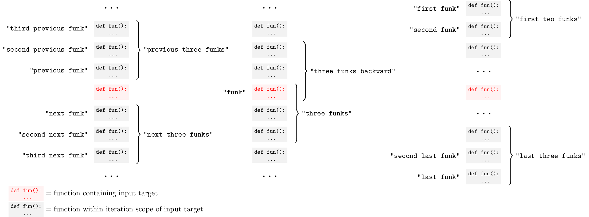

# Cursorless documentation

Welcome to Cursorless! You may find it helpful to start with the [tutorial videos](https://www.youtube.com/watch?v=5mAzHGM2M0k&list=PLXv2sppxeoQZz49evjy4T0QJRIgc_JPqs).

This guide assumes you've already [installed Cursorless](installation.md).

Once you understand the concepts, you can pull up a cheatsheet for reference by saying either `"cursorless reference"` or `"cursorless cheatsheet"` with VSCode focused.

You can get back to these docs by saying `"cursorless docs"`, `"cursorless help"` within VSCode.

Note: If you'd like to customize any of the spoken forms, please see [Customization](customization.md).

## Overview

Every cursorless command consists of an action performed on a target. For example, the command `"chuck bat"` deletes the token with a hat over the `b`. In this command, the action is `"chuck"` (delete), and the target is `"bat"`. There are no actions without at least one target.


## Targets

There are two types of targets: primitive targets and compound targets. Compound targets are constructed from primitive targets, so let's begin with primitive targets.

### Primitive targets

A primitive target consists of a mark and one or more optional modifiers. The simplest primitive targets just consist of a mark without any modifiers, so let's begin with those

#### Marks

There are several types of marks:

##### Decorated symbol

This is the first type of mark you'll notice when you start using cursorless. You'll see that for every token on the screen, one of its characters will have a hat on top of it. We can refer to the given token by saying the name of the character that has a hat, along with the color if the hat is not gray, and the shape of the hat if the hat is not the default dot:

- `"air"` (if the color is gray)
- `"blue bat"`
- `"blue dash"`
- `"blue five"`
- `"fox bat"`
- `"blue fox bat"`

The general form of this type of mark is:

`"[<color>] [<shape>] (<letter> | <symbol> | <number>)"`

Combining this with an action, we might say `"take blue air"` to select the token containing letter `'a'` with a blue hat over it.

###### Colors

The following colors are supported. Note that to target the default (gray) hat you don't need to specify a color.

| Spoken form | Color   | Internal ID  | Enabled by default? |
| ----------- | ------- | ------------ | ------------------- |
| N/A         | grey    | `default`    | ✅                  |
| `"blue"`    | blue    | `blue`       | ✅                  |
| `"green"`   | green   | `green`      | ✅                  |
| `"red"`     | red     | `red`        | ✅                  |
| `"pink"`    | pink    | `pink`       | ✅                  |
| `"yellow"`  | yellow  | `yellow`     | ✅                  |
| `"navy"`    | navy    | `userColor1` | ❌                  |
| `"apricot"` | apricot | `userColor2` | ❌                  |

You can enable or disable colors in your VSCode settings, by searching for `cursorless.hatEnablement.colors` and checking the box next to the internal ID for the given shape as listed above. To navigate to your VSCode settings, either say "show settings", or go to File --> Preferences --> Settings.

You can also tweak the visible colors for any of these colors in your VSCode settings, by searching for `cursorless.colors` and changing the hex color code next to the internal ID for the given shape as listed above. Note that you can configure different colors for dark and light themes. See our [visual accessibility guide](visualAccessibility.md) for more on visual accessibility.

If you find these color names unintuitive / tough to remember, their
spoken forms can be [customized](customization.md) like any other spoken form
in Cursorless. If you change a spoken form to be more than one syllable, you
can change the penalty in the `cursorless.hatPenalties.colors` setting to the
number of syllables you use, so that Cursorless can optimize hat allocation to
minimize syllables.

###### Shapes

The following shapes are supported. Note that to target the default (dot) shape you don't need to specify a shape.

| Spoken form | Shape                                                    | Internal ID  | Enabled by default? |
| ----------- | -------------------------------------------------------- | ------------ | ------------------- |
| N/A         |        | `default`    | ✅                  |
| `"bolt"`    |              | `bolt`       | ❌                  |
| `"curve"`   |            | `curve`      | ❌                  |
| `"fox"`     |                | `fox`        | ❌                  |
| `"frame"`   |            | `frame`      | ❌                  |
| `"play"`    |              | `play`       | ❌                  |
| `"wing"`    |              | `wing`       | ❌                  |
| `"hole"`    |              | `hole`       | ❌                  |
| `"ex"`      |                  | `ex`         | ❌                  |
| `"cross"`   |  | `crosshairs` | ❌                  |
| `"eye"`     |                | `eye`        | ❌                  |

You can enable or disable shapes in your VSCode settings, by searching for `cursorless.hatEnablement.shapes` and checking the box next to the internal ID for the given shape as listed above. To navigate to your VSCode settings, either say "show settings", or go to File --> Preferences --> Settings.

If you find these shape names unintuitive / tough to remember, their
spoken forms can be [customized](customization.md) like any other spoken form
in cursorless. If you change a spoken form to be more than one syllable, you
can change the penalty in the `cursorless.hatPenalties.shapes` setting to the
number of syllables you use, so that cursorless can optimize hat allocation to
minimize syllables.

##### `"this"`

The word `"this"` can be used as a mark to refer to the current cursor(s) or selection(s) as a target. Note that when combined with a modifier, the `"this"` mark can be omitted, and it will be implied.

- `"chuck this"`
- `"take funk this"`
- `"pre funk"`
- `"chuck line"`

Note that if you say `"this"` with an empty selection, it refers to the token containing your cursor.

##### `"that"`

The word `"that"` can be used as a mark to refer to the target of the previous cursorless command.

- `"pre that"`
- `"round wrap that"`

##### `"row <number>"`

The word `"row"` followed by a number can be used to refer to a line by its line number. Note that the line numbers are modulo 100, meaning that you only say the last two digits of the line number. Also note that the line must be visible within the viewport.

- `"chuck row twenty four"`
- `"post row eighty nine"`
- `"pour row eleven"`

##### `"up <number>"` / `"down <number>"`

The word `"up"` or `"down"` followed by a number can be used to refer to the line that is `<number>` lines above or below the cursor. The line may be outside of the viewport. In the case of multiple selections, this mark only refers to the line relative to the primary selection. You can turn on relative line numbers in the VSCode settings to make these marks easier to use.

- `"copy up one"`
- `"comment down two"`

#### Modifiers

Modifiers can be applied to any mark to modify its extent. This is commonly used to refer to larger syntactic elements within a source code document.

Note that if the mark is `"this"`, and you have multiple cursors, the modifiers will be applied to each cursor individually.

##### Syntactic scopes

For programming languages where Cursorless has rich parse tree support, we support modifiers that expand to the nearest containing function, class, etc. See [the source code](../../../../../packages/common/src/scopeSupportFacets/languageScopeSupport.ts) for a list of supported languages. Below is a list of supported scope types, keeping in mind that this table can sometimes lag behind the actual list. Your cheatsheet (say `"cursorless cheatsheet"` with VSCode focused) will have the most up-to-date list. It can also be helpful to use the [scope visualizer](./scope-visualizer.md) to visualize the scope types on your own code, though keep in mind that the scope visualizer only works on language scopes that have been upgraded to our next-gen scope engine, so it may not work every time.

| Term           | Syntactic element                                   |
| -------------- | --------------------------------------------------- |
| `"arg"`        | function parameter or function call argument        |
| `"attribute"`  | attribute, eg on html element                       |
| `"branch"`     | branch of a `switch` or `if` statement              |
| `"call"`       | function call, eg `foo(1, 2)`                       |
| `"callee"`     | the function being called in a function call        |
| `"class name"` | the name in a class declaration                     |
| `"class"`      | class definition                                    |
| `"comment"`    | comment                                             |
| `"condition"`  | condition, eg in an if statement, while loop etc    |
| `"element"`    | xml element                                         |
| `"end tag"`    | xml end tag                                         |
| `"funk name"`  | the name in a function declaration                  |
| `"funk"`       | name function declaration                           |
| `"if state"`   | if statement                                        |
| `"item"`       | an entry in a map / object / list                   |
| `"key"`        | key in a map / object                               |
| `"lambda"`     | anonymous lambda function                           |
| `"list"`       | list / array                                        |
| `"map"`        | map / object                                        |
| `"name"`       | the name in a declaration (eg function name)        |
| `"regex"`      | regular expression                                  |
| `"start tag"`  | xml start tag                                       |
| `"state"`      | a statement, eg `let foo;`                          |
| `"string"`     | string                                              |
| `"tags"`       | xml both tags                                       |
| `"type"`       | a type annotation or declaration                    |
| `"unit"`       | a unit, eg `px` in `100px`                          |
| `"value"`      | a value eg in a map / object, return statement, etc |

For example, `"take funk blue air"` selects the function containing the token with a blue hat over the letter `'a'`.

##### `"previous"` / `"next"` / `<ordinal>` / `<number>`

We support several modifiers that allow you to refer to scopes relative to the input target, or relative to the canonical iteration scope of the scope type. For example, the iteration scope of functions is a class, of tokens is a line, of characters is a token, etc.

Here is a diagram of the possible relative / ordinal modifiers using the `funk` scope as an example:

<div className="dark-mode-invert">
  
</div>

([Image source](https://github.com/cursorless-dev/cursorless/blob/main/docs/user/images/relative_ordinal.tex))

And here is a table of the spoken forms:

| Spoken form                    | Description                                                         | Example                       |
| ------------------------------ | ------------------------------------------------------------------- | ----------------------------- |
| `"[number] [scope]s"`          | `[number]` instances of `[scope]` including target, going forwards  | `"take three funks"`          |
| `"[number] [scope]s backward"` | `[number]` instances of `[scope]` including target, going backwards | `"take three funks backward"` |
| `"[nth] [scope]"`              | `[nth]` instance of `[scope]` in iteration scope                    | `"take third funk"`           |
| `"[nth] last [scope]"`         | `[nth]`-to-last instance of `[scope]` in iteration scope            | `"take third last funk"`      |
| `"[nth] next [scope]"`         | `[nth]` instance of `[scope]` after target                          | `"take third next funk"`      |
| `"[nth] previous [scope]"`     | `[nth]` instance of `[scope]` before target                         | `"take third previous funk"`  |
| `"first [number] [scope]s"`    | First `[number]` instances of `[scope]` in iteration scope          | `"take first three funks"`    |
| `"last [number] [scope]s"`     | Last `[number]` instances of `[scope]` in iteration scope           | `"take last three funks"`     |
| `"next [number] [scope]s"`     | next `[number]` instances of `[scope]`                              | `"take next three funks"`     |
| `"next [scope]"`               | Next instance of `[scope]`                                          | `"take next funk"`            |
| `"previous [number] [scope]s"` | previous `[number]` instances of `[scope]`                          | `"take previous three funks"` |
| `"previous [scope]"`           | Previous instance of `[scope]`                                      | `"take previous funk"`        |

You can prefix the modifier with `"every"` to yield multiple targets rather than a range. For example, `"take every two tokens"` selects two tokens as separate selections.

##### `"every"`

The modifier `"every"` can be used to select a syntactic element and all of its matching siblings.

- `"take every key air"`
- `"take every funk air"`
- `"take every key"` (if cursor is currently within a key)

For example, the command `"take every key [blue] air"` will select every key in the map/object/dict including the token with a blue hat over the letter 'a'.

###### Use with relative / ordinal modifiers

The modifier `every` can also be used to cause [relative / ordinal modifiers](#previous--next--ordinal--number) to yield multiple targets rather than a range:

- `"take every two tokens"` selects two tokens as separate selections
- `"pre every first two lines"` puts a cursor before each of first two lines in block (results in multiple cursors)

##### `"grand"`

The modifier `"grand"` can be used to select the parent of the containing syntactic element.

- `"take grand statement air"`
- `"take grand funk air"`

For example, the command `"take grand statement [blue] air"` will select that parent statement of the statement containing the token with a blue hat over the letter 'a'.

##### Sub-token modifiers

###### `"sub"`

If you need to refer to the individual words within a `camelCase`/`snake_case` token, you can use the `"sub"` modifier. For example,

- `"second sub air"`
- `"second past fourth sub air"`
- `"last sub air"`

For example, the following command:

    "take second past fourth sub blue air"

Selects the second, third and fourth word in the token containing letter 'a' with a blue hat.

###### `"char"`

You can also refer to individual characters within a token:

- `"second char air"`
- `"second past fourth char air"`
- `"last char air"`

##### `"line"`

The word `"line"` can be used to expand a target to refer to entire lines rather than individual tokens:

eg:
`take line [blue] air`
Selects the line including the token containing letter 'a' with a blue hat.

##### `"block"`

The `"block"` modifier expands to above and below the target to select lines until an empty line is reached.

- `"take block"`
- `"take block <TARGET>"`

##### `"short block"`

The `"short block"` scope is like `"block"`, but in addition to stopping at empty lines, it will also stop at the boundary of a [surrounding pair](#surrounding-pair).
For example, given the text...

```
{
  aaa
  {
    bbb
    ccc
  }
}
```

`"take short block bat"` would select the two lines with `bbb` and `ccc`. See [short paint](#short-paint) for a more detailed walkthrough of a scope not exiting surrounding pairs.

##### `"file"`

The word '`"file"` can be used to expand the target to refer to the entire file.

- `"copy file"`
- `"take file"`
- `"take file blue air"`

For example, `"take file [blue] air"` selects the file including the token containing letter 'a' with a blue hat.

##### `"head"` and `"tail"`

The modifiers `"head"` and `"tail"` can be used to expand a target through the beginning or end of the line, respectively.

- `"take head"`: select from the cursor the start of the line
- `"take tail"`: select from the cursor to the end of the line
- `"take head air"`: selects the mark through to start of the line
- `"take tail air"`: selects the mark through to the end of the line

When inside a single-line surrounding pair (eg parentheses, brackets, etc) the head/tail modifier will only expand to the interior of that pair instead of the whole line. You can explicitly say `"head line"` or `"tail line"` to get the line behavior.

When followed by a modifier, they will expand their input to the start or end of the given modifier range. For example:

- `"take head funk"`: select from the cursor the start of the containing function
- `"chuck tail class air"`: Delete from the token with a hat over the letter `a` through the end of its containing class

##### `"token"`

The `"token"` modifier expands its input to the nearest containing token. This modifier is often used without a mark, either to select the token adjacent to your cursor or to expand your selection to the nearest containing token range. For example:

- `"copy token"`
- `"take token"`
- `"chuck token"`

##### `"identifier"`

The `"identifier"` modifier behaves like `"token"`, but only considers tokens that are viable identifiers. For example `"identifier"` could be used to select `foo`, `fooBar`, or `foo_bar`, but not `.`, `=`, `+=`, etc. For example:

- `"copy identifier"`
- `"take identifier"`
- `"chuck identifier"`

This scope type is useful with ordinals, allowing you to say eg `"last identifier"` to refer to the last identifier on the current line.

##### `"paint"`

Both of the commands below will expand from the mark forward and backward to include all adjacent non-whitespace characters.

- `"take paint"`
- `"take paint <TARGET>"`

For example, in the following text:

```
foo.bar baz|bongo
```

Saying `"every paint"` would select `foo.bar` and `baz|bongo`.

##### `"short paint"`

The `"short paint"` scope is like `"paint"`, but in addition to stopping at whitespace, it will also stop at the boundary of a [surrounding pair](#surrounding-pair). For example, given the text

```
(aaa[bbb]ccc ddd)
```

- `"take short paint air"` would select `aaa[bbb]ccc`.
  - The target starts as `aaa`.
  - Trying to expand to the left, we immediately hit a `(`, which is part of a paren pair that surrounds the original `aaa`, so that stops leftward expansion.
  - Trying to expand to the right, we hit a `[`, and that pair of square brackets does not surround the original `aaa`, so rightward expansion continues.
  - Rightward expansion continues over the `ccc`, then hits a space and stops.
- `"take short paint square"` would select `aaa[bbb]ccc`.
  - The target starts as `[`.
  - The expansion is not stopped by either the square brackets because they do not surround themselves.
- `"take short paint bat"` would select `bbb`.
  - The target starts as `bbb`.
  - The expansion is stopped by the square packets that surround `bbb`.

##### `"instance"`

The `"instance"` modifier searches for occurrences of the text of the target. For example:

- `"take every instance air"`: selects all instances of the token with a hat over the letter `a` in the whole document
- `"take two instances air"`: selects the first two instances of the token with a hat over the letter `a`, starting from that token itself
- `"take next instance air"`: selects the next instance of the token with a hat over the letter `a`, starting from that token itself
- `"chuck every instance two tokens air"`: deletes all occurrences of the two tokens beginning from the token with a hat over the letter `a`. For example if there were a hat over the `a` in `aaa.bbb`, it would delete every occurrence of `aaa.` in the file.
- `"take every instance air past bat"`: if there were hats over the `a` and `b` in `aaa ccc bbb ddd`, it would selects all occurrences of `aaa ccc bbb` (which is the text corresponding to the range `"air past bat"`)

Note in the final example how the `"instance"` modifier constructs the instance based on the range `"air past bat"`, rather than the individual tokens `"air"` and `"bat"`, as you might expect given the way other modifiers behave. Effectively `"instance"` applies to everything after the `"instance"` modifier, rather than just the next modifier.

Note also that `"instance"` considers the type of target used to construct the instance. So for example, `"take every instance air"` will only select tokens that
are identical to the token with a hat over the letter `a`, skipping over bigger tokens that contain the token with a hat over the letter `a` as a substring. For example, if there were a hat over the `a` in `aaa`, it would select every occurrence of `aaa` in the file, but not `aaaaa`. If you want to avoid this behaviour, you can
use the `"just"` modifier, eg `"take every instance just air"`.

If your cursor is touching a token, you can say `"take every instance"` to select all instances of the given token, (or `"chuck two instances"` to delete the token and its next occurrence, `"pre next instance"` to place your cursor before the next occurrence, etc).

Pro tip: if you say eg `"take five instances air"`, and it turns out you need more, you can say eg `"take that and next two instances that"` to select the next two instances after the last instance you selected.

###### Experimental: `"from"`

We have experimental support for prefixing a command with `"from <target>"` to narrow the range within which `"every instance"` searches, or to set the start point from which `"next instance"` searches. For example:

- `"from funk take every instance air"`: selects all instances of the token with a hat over the letter `a` in the current function
- `"from air take next instance bat"`: selects the next instance of the token with a hat over the letter `b` starting from the token with a hat over the letter `a`

Note that the `"from"` modifier is not enabled by default; you must remove the `-` at the start of the line starting with `-from` in your `experimental/experimental_actions.csv` [settings csv](./customization.md). Note also that this feature is considered experimental and may change in the future.

##### `"just"`

The `"just"` modifier strips the target of any semantic information, treating it as just a raw range, with the following effects:

- The new target has no leading or trailing delimiters. For example:

  - `"chuck just air"` will delete just the air token, leaving adjacent spaces undisturbed, unlike the default behaviour of `"chuck air"` that deletes the air token _and_ cleans up adjacent whitespace as appropriate. Ie for

    ```
    bbb aaa ccc
    ```

    `"chuck just air"` would result in `bbb  ccc` (note the double space in the middle), whereas `"chuck air"` would result in `bbb ccc`.

  - `"chuck just line"` will delete only the content of the current line, without removing the line ending, resulting in a blank line, unlike the default behaviour of `"chuck line"` that removes the line entirely, leaving no blank line.

- A raw range does not have its own insertion delimiters.
  - For example, `"paste after just air"` will paste directly after the air token, without inserting a space, as opposed to the way `"paste after air"` would insert a space before the pasted content.
  - If you use `"just"` on the destination of a `"bring"` command, it will inherit its insertion delimiters from the source of the `"bring"` action. For example, in the command `"bring arg air and bat after just paren"`, the `"air"` and `"bat"` arguments will be joined by commas. In contrast, `"bring arg air and bat after token paren"` would join the arguments with spaces.
- In the case of [`"instance"`](#instance), by default `"every instance air"` will only consider instances of the air token that are themselves full tokens, but `"every instance just air"` doesn't have such a restriction, because we've stripped air of its semantic "token-ness".

Some examples:

- `"chuck just air"`: deletes just the air token, leaving spaces undisturbed.
- `"chuck just line"`: deletes just the content of the line, leaving a blank line.
- `"bring bat after just air"`: results in something like `aaabbb` where the bat token was copied after the air token with no delimeter between them.

##### Surrounding pair

Cursorless has support for expanding the selection to the nearest containing paired delimiter, eg the surrounding parentheses, curly brackets, etc.

- `"take round"` expands selection to include containing parentheses `(` and `)`
- `"take curly"` expands selection to include containing braces `{` and `}`
- `"take box"` expands selection to include containing brackets `[` and `]`. See [paired delimiters](#paired-delimiters) for other possible surrounding pairs.
- `"take inside round"` is the same as `"take round"`, but excludes the parentheses themselves
- `"take bounds round"` selects only the parentheses
- `"take pair"` expands to include the nearest containing pair of any kind
- `"take bounds"` selects the nearest containing paired delimiters themselves of any kind
- `"take inside"` selects until the nearest containing paired delimiters of any kind, but doesn't include the delimiters themselves
- `"take round air"` selects the parentheses containing the token with a hat over the `a`.

See [paired delimiters](#paired-delimiters) for a list of possible surrounding pairs.

###### Ambiguous delimiters (`"`, `'`, `` ` ``, etc)

For some delimiter pairs, the opening and closing delimiters are the same character, eg `"`, `'`, and `` ` ``. In this case, cursorless somehow needs to determine whether a given instance of the character is an opening or closing delimiter. When we have access to a parse tree, such as in typescript or python, this is not a problem, because we can reliably determine whether a quotation mark is an opening or closing delimiter based on its position in the parse tree.

However, when we are in a language where we don't have access to a parse tree, such is in a plaintext or markdown file, or within a comment or string within a parsed language, it is not possible to reliably determine whether we are looking at an opening or closing delimiter.

In this case, we resort to a simple heuristic to determine whether a character is an opening or closing delimiter: we consider the first instance of the given delimiter on a line to be an opening delimiter, and every subsequent delimiter alternates between being treated as an opening and closing delimiter. For example:

```
This is a "line with" a few "quotation marks" on it
          ↑         ↑       ↑               ↑
       opening   closing opening         closing
```

##### `"its"`

The the modifier `"its"` is intended to be used as part of a compound target, and will tell Cursorless to use the previously mentioned mark in the compound target.

For example, `"take air past end of its line"` selects the range from the token containing letter `a` to the end of the line containing the same token. This is in contrast from `"take air past end of line"` which selects the range from the token containing letter `a` to the end of the line containing the current selection.

Another example is `"bring air to its value"`, which would cause the token with a hat over `a` to replace the return value containing it.

### Compound targets

Individual targets can be combined into compound targets to make bigger targets or refer to multiple selections at the same time.

#### Range targets

A range target uses one primitive target as its start and another as its end to form a range from the start to the end. For example, `"air past bat"` refers to the range from the token with a hat over its 'a' to a token with a hat over its 'b'.

Note that if the first target is omitted, the start of the range will be the current selection(s).

- `"take [blue] air past [green] bat"`
- `"take past [blue] air"`
- `"take funk [blue] air past [blue] bat"` (note end of range inherits `"funk"`)
- `"take funk [blue] air past token [blue] bat"`
- `"take past before [blue] air"`
- `"take after [blue] air past before [blue] bat"`
- `"take past end of line"`
- `"take past start of line"`
- `"take [blue] air past end of line"`

eg:
`take blue air past green bat`
Selects the range from the token containing letter 'a' with a blue hat past the token containing letter 'b' with a green hat.

##### Vertical ranges

The `"slice"` range modifier is used to refer to multiple targets that are vertically aligned. It is commonly used with the `"pre"` action to add multiple cursors to the editor. Each cursor is inserted at the same column on each row requested within the command.

- `"pre <TARGET 1> slice past <TARGET 2>"`: Add cursors from the first target through to the second target's line(inclusive end)
- `"pre <TARGET 1> slice <TARGET 2>"`: Shortened version of above `"slice past"` command
- `"pre <TARGET 1> slice until <TARGET 2>"`: Add cursors until the second target's line(non-inclusive end)
- `"pre <TARGET 1> slice between <TARGET 2>"`: Add cursors between first and second target's lines(non-inclusive start and end)

For example:

- `"pre air slice bat"`: Places cursors at the same position on every line (inclusive) between token with hat over the `a` and token with the hat over the `b`. The position will be the start of the token with a hat over the `a`
- `"chuck tail air slice end of block"`: Delete the end of every line from air through the end of its non-empty line block.

##### `"every"` ranges

If the range target begins with `"every <scope>"`, eg `"take every line air past bat"`, then you will end up with one target for each instance of `<scope>` in the range. For example, `"post every line air past bat"` will put a cursor at the end of every line from the line containing the token with a hat over the letter `a` to the line containing the token with a hat over the letter `b`.

These `"every"` ranges also play nicely with exclusive ranges, eg `"take every funk air until bat"` will select every function starting from the function containing the token with a hat over the letter `a` up until, but not including, the function containing the token with a hat over the letter `b`.

#### List targets

In addition to range targets, cursorless supports list targets, which allow you to refer to multiple targets at the same time. When combined with the `"take"` action, this will result in multiple cursors, for other actions, such as `"chuck"` the action will be applied to all the different targets at once.

- `"take [blue] air and [green] bat"`
- `"take funk [blue] air and [green] bat"` (note second target inherits `"funk"`)
- `"take funk [blue] air and token [green] bat"`
- `"take air and bat past cap"`

eg:
`take blue air and green bat`
Selects both the token containing letter 'a' with a blue hat AND the token containing 'b' with a green hat.

## Actions

In any cursorless command, the action defines what happens to the specified target. Every command must have a target. For example, deleting the target (`"chuck"`, as in `"chuck air"`) or moving the cursor to select the target (`"take"`, as in `"take air"`).

### Cursor movement

Despite the name cursorless, some of the most basic commands in cursorless are for moving the cursor.

Note that when combined with list targets, `take`/`pre`/`post` commands will result in multiple cursors.

- `"take <TARGET>"`: Selects the given target.
- `"pre <TARGET>"`: Places the cursor before the given target.
- `"post <TARGET>"`: Places the cursor after the given target.
- `"append <TARGET>"`: Selects the given target, while preserving your existing selections.
- `"append pre <TARGET>"`: Adds a new cursor before the given target, while preserving your existing selections.
- `"append post <TARGET>"`: Adds a new cursor after the given target, while preserving your existing selections.
- `"give <TARGET>"`: Deselects the given target.

eg:
`pre blue air`
Moves the cursor to before the token containing letter 'a' with a blue hat.

### Delete

This command can be used to delete a target without moving the cursor

- `"chuck <TARGET>"`

eg:
`chuck blue air`
Deletes the token containing letter 'a' with a blue hat.

### Changing a target

This command will delete a target and leave the cursor where the target used to be, making it easy to change a target

- `"change <TARGET>"`
  eg:
  `change blue air`
  Deletes the token containing letter 'a' with a blue hat then places your cursor where the token had been.

### `"clone"` / `"clone up"`

These commands insert a copy of the target either before or after the target itself, leaving your cursor(s) in the newly created clone.

- `"clone <TARGET>"`
- `"clone up <TARGET>"`

For example:

- `"clone funk"` inserts a copy of the function containing your cursor just below the function
- `"clone up funk"` inserts a copy of the function containing your cursor just above the function
- `"clone state air"` inserts a copy of the statement containing `a` with a gray hat below the given statement itself

### Cut / copy

- `"carve <TARGET>"`: cut
- `"copy <TARGET>"`: copy

eg:
`copy blue air`
Copies the token containing letter 'a' with a blue hat.

### Swap

Swaps two targets. If the first target is omitted, it will target the current selection. If `<Target 1>` and `<Target 2>` each consist of multiple targets, they will be zipped together.

- `"swap <TARGET 1> with <TARGET 2>"`
- `"swap with <TARGET>"`
- `"swap air and bat with cap and drum"` is equivalent to `"swap air with cap"` and `"swap bat with drum"`

eg:
`swap blue air with green bat`

Swaps the given tokens.

### Indent / dedent

- `"dedent <TARGET>"` decreases the indentation level of `<TARGET>`
- `"indent <TARGET>"` increases the indentation level of `<TARGET>`

For example:

- `"indent air"`
- `"dedent funk bat"`

### Increment / decrement

- `"increment <TARGET>"`: increment number target. eg change `1` to `2`.
- `"decrement <TARGET>"`: decrement number target. eg change `2` to `1`.

### Insert empty lines

- `"drink <TARGET>"`: Inserts a new line above the target line, and moves the cursor to the newly created line
- `"pour <TARGET>"`: Inserts a new line below the target line, and moves the cursor to the newly created line

eg: `pour blue air` will insert empty line below the token containing letter 'a' with a blue hat and moves the cursor to the new line.

Note: `"drink"` and `"pour"` are actually a bit more versatile than just lines.
If you use a [syntactic scope](#syntactic-scopes) modifier on the target, then`"drink"` and `"pour"` will do the
appropriate insertions to prepare the text for a new instance of that scope.

eg: `pour item air` will insert a comma and space after the air item, and place the cursor after the inserted characters.

### Homophones

The `"phones"` command can be used to cycle through homophones for a given target. For example, if there were a hat on the `h` in `where`, you could say `"phones harp"` to change it to `wear`.

- `"phones <TARGET>"`

eg:

- `"phones air"`
- `"phones first word air"`

### Rename

Executes vscode rename action on the specified target

- `"rename <TARGET>"`

eg:
`rename blue air`
Rename the token containing letter 'a' with a blue hat.

### Scroll

Scrolls a given target to the top, center or bottom of the screen.

- `"crown <TARGET>"`: top
- `"center <TARGET>"`: center
- `"bottom <TARGET>"`: bottom

eg `crown blue air` scrolls the line containing the letter 'a' with a blue hat to the top of the screen.

### Insert/Use/Repeat

The `"bring"` command can be used to replace one target with another, or to use a target at the current cursor position.

- `"bring <TARGET>"`: Inserts the given target at the cursor position
- `"bring <TARGET 1> to <TARGET 2>"`

eg:
`bring blue air to green bat`
Replaces the token containing letter 'b' with a green hat using the token containing letter 'a' with a blue hat.

### Move/Replace

The `"move"` command can be used to move a target.

- `"move <TARGET>"`: Moves the given target to the cursor position
- `"move <TARGET 1> to <TARGET 2>"`: Replaces `TARGET 2` with `TARGET 1` and deletes `TARGET 1`

eg:
`move blue air to green bat`
Replaces the token containing letter 'b' with a green hat using the token containing letter 'a' with a blue hat, and the delete the latter token.

### Reverse/Shuffle/Sort

These commands accept multiple selections, and change their order. For example:

- `"shuffle every item <TARGET>"`
- `"sort every item <TARGET>"`
- `"reverse every item <TARGET>"`
- `"sort line air slice bat"`: sort lines within the selection.
- `"sort this"`: Sort the multiple selections.

### Wrap/Rewrap

The wrap command can be used to wrap a given target with a pair of symbols

- `"round wrap <TARGET>"`: wraps the target with parentheses
- `"box wrap <TARGET>"`: wraps the target with square brackets

eg:
`box wrap blue air`
Wraps the token containing letter 'a' with a blue hat in square brackets.

The rewrap command, mapped to `"repack"` by default, can be used to swap a given pair of symbols with another

- `"curly repack <TARGET>"`: wraps the target with curly brackets, replacing the previous paired delimiter

See [paired delimiters](#paired-delimiters) for a list of possible wrappers.

### \[experimental\] Snippets

See [experimental documentation](experimental/snippets.md).

### Show definition/reference/quick fix

Each of these commands performs a vscode action of the same or a similar name on the target.

- `"define <TARGET>"` navigate to the definition of the target
- `"reference <TARGET>"` search the workspace for all references to the target
- `"hover <TARGET>"` displays the tooltip that would appear if you hovered the mouse over the target
- `"quick fix <TARGET>"` displays quick fixes and refactors suggested by the vscode
- `"scout <TARGET>"` search the document for the target
- `"scout all <TARGET>"` search the workspace for the target

eg:
`define blue air`
Shows definition for the token containing letter 'a' with a blue hat.

### Fold/unfold

- `"fold <TARGET>"`
- `"unfold <TARGET>"`

eg:
`fold funk blue air`
Fold the function with the token containing letter 'a' with a blue hat.

### Extract

Extracts a target as a variable using the VSCode refactor action

- `"extract <TARGET>"`

eg:
`extract call air`

Extracts the function call containing the decorated 'a' into its own variable.

### Join

Join multiple lines together.

- `"join <TARGET>"`

eg:

- `join air`: Join the line with the token containing the letter 'a' with its next line.
- `join block air`: Joines all lines in the paragraph with the token containing the letter 'a' together into a single line.

### Break

Break line in two.

- `"break <TARGET>"`

eg:

- `break air`: Break the line with the token containing the letter 'a'. 'a' is now the first token on the new line.

## Paired delimiters

| Default spoken form | Delimiter name        | Symbol inserted before target | Symbol inserted after target | Is wrapper? | Is selectable? |
| ------------------- | --------------------- | ----------------------------- | ---------------------------- | ----------- | -------------- |
| `"curly"`           | curly brackets        | `{`                           | `}`                          | ✅          | ✅             |
| `"diamond"`         | angle brackets        | `<`                           | `>`                          | ✅          | ✅             |
| `"escaped quad"`    | escaped double quotes | `\\"`                         | `\\"`                        | ✅          | ✅             |
| `"escaped round"`   | escaped parentheses   | `\\(`                         | `\\)`                        | ✅          | ✅             |
| `"escaped twin"`    | escaped single quotes | `\\'`                         | `\\'`                        | ✅          | ✅             |
| `"pair"`            | any                   | N/A                           | N/A                          | ❌          | ✅             |
| `"quad"`            | double quotes         | `"`                           | `"`                          | ✅          | ✅             |
| `"round"`           | parentheses           | `(`                           | `)`                          | ✅          | ✅             |
| `"skis"`            | backtick quotes       | `` ` ``                       | `` ` ``                      | ✅          | ✅             |
| `"box"`             | square brackets       | `[`                           | `]`                          | ✅          | ✅             |
| `"twin"`            | single quotes         | `'`                           | `'`                          | ✅          | ✅             |
| `"void"`            | space                 | ` `                           | ` `                          | ✅          | ❌             |
