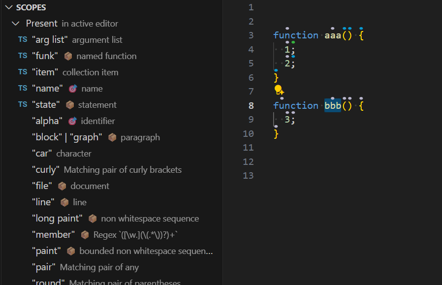

# The Cursorless sidebar

You can say `"bar cursorless"` to show the Cursorless sidebar.

## Scopes

- List showing all scopes, organized by whether they are present and supported in the active text editor.
- As you type or move your selection, the list of present scopes will update in real time.
- Clicking on a scope will visualize it using the [scope visualizer](scope-visualizer.md).
- Display the users custom spoken forms

### Scope icons

To find a scope that matches your current selection look for the following icons:

🎯 scope is equal to selection\
📦 scope contains selection

## Tutorial

Interactive tutorial to learn Cursorless
